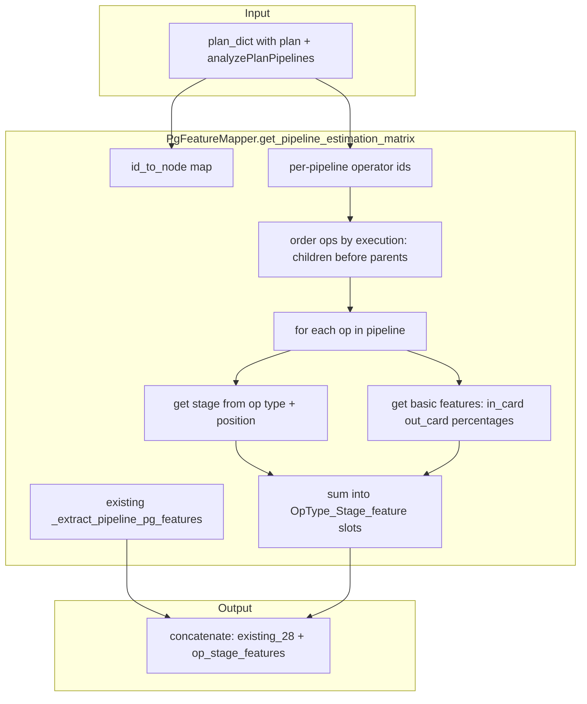

# PG Operator-Stage Features (Umbra-Style)

## Goal

Add operator-level and stage-level features to PgFeatureMapper (like T3 Umbra core) while **keeping all existing PG aggregate features**. The feature vector will have:

1. **Existing 28 PgFeature values** (aggregate per-pipeline)
2. **Operator-stage features** for each (PG_operator_type, stage) pair: count, in_card, out_card, in_percentage, out_percentage, right_percentage, right_card, etc., following the T3 paper (Section 3, Figure 4, Listing 1).

## T3 Paper: Operator Stages and Basic Features

From the paper (Figure 4, Section 3):

**Stages:**

- **Build**: Tuples come in, materialize (e.g. Hash Join build, Hash, Materialize, Sort build, Aggregate build)
- **Probe**: Tuples from right input, compute, output (e.g. Hash Join probe)
- **Scan**: Operator scans tuples and outputs (e.g. Table Scan, Sort scan, Aggregate scan)
- **Pass-Through**: Tuples enter and leave (e.g. Gather, Limit, Select)

**Basic features per stage:**

- Percentage of tuples at pipeline start that reach a stream (in_percentage, out_percentage, right_percentage)
- Tuple size in bytes (in_size, out_size)
- Cardinality of streams (in_card, out_card, right_card)
- Count (const) for duplicate operators

**Feature encoding (Listing 1):** For each operator in pipeline, determine stage, increment count, add basic features. Sum over operators. Fixed-size vector (~110 in Umbra).

## Build vs Probe: Do NOT Assume Left/Right

**Critical:** In PostgreSQL and zeroshot plans, build and probe are determined by **inner/outer semantics**, not by child array index. The **build side** is the one with the Hash operator (inner); the **probe side** is the outer input.

- **PostgreSQL EXPLAIN**: Uses "Parent Relationship": "Inner" (build) vs "Outer" (probe). The Hash node wraps the build-side plan. Plans[0] can be Outer or Inner depending on planner choice.
- **Zeroshot format**: `children` array order may vary. The build side is the child that has (or wraps) `op_name == "Hash"`. The other child is the probe side.
- **Current zeroshot_to_t3** ([src/zeroshot/zeroshot_to_t3.py](src/zeroshot/zeroshot_to_t3.py) lines 196-202): Assumes `children[0]=outer`, `children[1]=Hash` (inner). This is fragile if parsers or PostgreSQL output order differs.
- **JH dataloader** ([src/t3_jh/jh_dataloader.py](src/t3_jh/jh_dataloader.py) line 259): Raises if Hash is not at index 1 — rejects plans where Hash is at index 0.

**Required fix:** Identify build/probe by **finding the Hash child**, not by index:

```python
def _get_hash_join_build_probe_children(children: list) -> tuple[dict|None, dict|None]:
    """Return (build_child, probe_child). Build = child with Hash (inner); probe = other (outer)."""
    if len(children) < 2:
        return None, children[0] if children else None
    for i, ch in enumerate(children):
        op = ch.get("plan_parameters", {}).get("op_name", "")
        if op == "Hash":
            build = (ch.get("children") or [None])[0] if ch.get("children") else ch
            probe = children[1 - i]
            return build, probe
    # No Hash found (Merge Join?): fallback — cannot infer; use heuristics or fail
    return children[1], children[0]  # Merge Join: inner often second
```

**Where to apply:**

1. **zeroshot_to_t3 `_convert_node`** (Hash Join): Use `_get_hash_join_build_probe_children(children)` instead of assuming `outer=children[0], inner=children[1]`. Set `out["left"]=build`, `out["right"]=probe`.
2. **PgFeatureMapper**: Reads from converted `plan_dict`. After the fix, `left` = build, `right` = probe. Use `node["left"]` for build cardinality, `node["right"]` for probe cardinality.
3. **Merge Join**: No Hash child — both sides are sort streams. PostgreSQL EXPLAIN uses "Parent Relationship": "Outer"/"Inner" but zeroshot plan_parameters may not include it. Fallback: use children[0]=outer, children[1]=inner (PostgreSQL often puts outer first). For Merge Join, build/probe semantics are less critical (no hash table). Keep current zeroshot_to_t3 behavior for Merge Join unless Parent Relationship is found in zeroshot data.

---

## PG Operators in Zeroshot Plans

From [src/pg_features.py](src/pg_features.py) and zeroshot JSONs:


| PG op_name                                                            | Umbra equivalent | Stages                          |
| --------------------------------------------------------------------- | ---------------- | ------------------------------- |
| Seq Scan, Parallel Seq Scan, Index Scan, Index Only Scan              | TableScan        | Scan                            |
| Hash Join, Merge Join                                                 | HashJoin         | Build, Probe                    |
| Nested Loop                                                           | IndexNLJoin      | Probe (build in other pipeline) |
| Sort                                                                  | Sort             | Build, Scan                     |
| Aggregate, Partial Aggregate, Finalize Aggregate                      | GroupBy          | Build, Scan                     |
| Hash, Materialize                                                     | Temp             | Build                           |
| Gather, Memoize, Limit, Append, Subquery Scan, Bitmap Heap/Index Scan | Select           | PassThrough                     |


## Architecture




## Implementation Plan

### 1. Define PG operator types and stage mapping

**New file or section in [src/pg_features.py](src/pg_features.py):**

- `PgOpType` enum: TableScan, HashJoin, IndexNLJoin, Sort, GroupBy, Temp, Select (map PG op_name to these)
- `PgOpStage` enum: Scan, Build, Probe, PassThrough (same as Umbra OperatorStage)
- `PgQualifiedFeature` mapping: `pipeline_time_features: dict[PgOpType, dict[PgOpStage, list[FeatureDim]]]` analogous to [src/features.py](src/features.py) lines 65-116
- Feature dims: scan (in_card, in_size), sink (out_card, out_size), input (in_percentage), out (out_percentage), right (right_percentage), right_card, input_card, expressions (for scans)

### 2. Pipeline operator ordering

The `analyzePlanPipelines` gives a **set** of operator ids per pipeline. We need **execution order** (children before parents). Add helper:

```python
def _get_pipeline_ops_in_execution_order(
    pipeline_op_ids: list[int],
    id_to_node: dict[int, dict],
    root_node: dict,
) -> list[tuple[int, dict]]:
    """Return (nid, node) list in execution order (post-order: children before parent)."""
```

Traverse the plan tree, collect only nodes in `pipeline_op_ids`, in post-order (visit children first). This yields execution order.

### 3. Stage determination per operator

For each (nid, node) in pipeline order:

- **Scans** (Seq Scan, etc.): stage = Scan
- **Hash Join, Merge Join**: 
  - If node has left child in same pipeline → Build (left is build side; in zeroshot, build is usually in *previous* pipeline)
  - If node has right child in same pipeline → Probe
  - Per zeroshot `_assign_pipelines`: join is in probe pipeline with right subtree. So join is always **Probe** in its pipeline.
- **Nested Loop**: Probe (right = build, in other pipeline)
- **Sort**: First op in pipeline → Scan; last op → Build
- **Aggregate** (all): First op → Scan; last op → Build
- **Hash, Materialize**: Build
- **Gather, Memoize, Limit, etc.**: PassThrough

### 4. Basic feature computation from PG data

For each operator stage, we have `node["pg"]` with: `act_card`, `est_card`, `est_width`, `act_time`, etc. We need:

- **in_card**: For Scan = scan input (zeroshot often has `act_children_card` or we use first scan's output). For Build = input child's act_card. For Probe = probe input act_card.
- **out_card**: node's act_card
- **right_card** (HashJoin Probe): Build-side cardinality = `node["left"]` act_card (after conversion fix: left=build). The probe consumes tuples from the pipeline; the build (right input to probe) is `node["left"]` in the converted plan.
- **in_percentage, out_percentage, right_percentage**: Need pipeline_scan_card. `in_percentage = in_card / pipeline_scan_card`, etc. Pipeline scan card = sum of scan ops' act_card in this pipeline (or from first scan).
- **in_size, out_size**: est_width from pg

**Note:** After the zeroshot_to_t3 build/probe fix, `node["left"]` = build (inner), `node["right"]` = probe (outer). For HashJoin Probe stage: right_card = build size = left child's act_card.

### 5. Feature vector layout

- **Part 1**: Existing 28 PgFeature values (unchanged)
- **Part 2**: Operator-stage features. Enumerate all (PgOpType, PgOpStage) pairs that have features. For each, add: const, then the basic features for that stage. Total slots = sum over (op_type, stage) of (1 + len(features)).

Example layout (conceptually):

```
[pg_est_card_sum, ..., pg_pipeline_root_act_card,  # 28 existing
 TableScan_Scan_const, TableScan_Scan_in_card, TableScan_Scan_in_size, TableScan_Scan_out_percentage, ...,
 HashJoin_Build_const, HashJoin_Build_out_card, HashJoin_Build_in_percentage, ...,
 HashJoin_Probe_const, HashJoin_Probe_input_card, HashJoin_Probe_right_percentage, HashJoin_Probe_out_percentage, ...,
 ...]
```

### 6. Join build/probe cardinalities

Explicitly add `pg_join_build_card_sum`, `pg_join_probe_card_sum` (from Option B) either as part of existing PgFeature or as part of HashJoin_Build/Probe features. The operator-stage features will naturally include:

- `HashJoin_Build_out_card` = build side act_card (from `node["left"]` after conversion — left=build)
- `HashJoin_Probe_right_card` = build size = same as above (right input to probe is the build)
- `HashJoin_Probe_input_card` = probe stream cardinality (from `node["right"]` — right=probe)

All of this relies on the zeroshot_to_t3 fix that identifies build/probe by the Hash child, not by array index.

### 7. Scan expressions (filter structure)

For TableScan_Scan, add expression features like Umbra: like_percentage, compare_percentage, in_expression_percentage, between_percentage, etc. We already have `_count_filter_columns` and filter counts in PgFeature. Reuse that for the Scan stage's expression features.

### 8. Backward compatibility and retraining

- **Breaking change**: Feature vector size and order change. All existing zeroshot models (e.g. model_zero_holdout_tpc_h_v5.txt) will be **incompatible**. Must retrain.
- **Training**: No code changes needed in [src/zeroshot/training_zeroshot_tpch_holdout.py](src/zeroshot/training_zeroshot_tpch_holdout.py) — it already uses `PgFeatureMapper.get_pipeline_estimation_matrix` and `get_names()`. The mapper will return the new larger matrix.

### 9. Files to modify


| File                                                             | Changes                                                                                                                                                                                                                                                                                                              |
| ---------------------------------------------------------------- | -------------------------------------------------------------------------------------------------------------------------------------------------------------------------------------------------------------------------------------------------------------------------------------------------------------------- |
| [src/zeroshot/zeroshot_to_t3.py](src/zeroshot/zeroshot_to_t3.py) | Add `_get_hash_join_build_probe_children(children)`; in `_convert_node` for Hash Join, use it to identify build/probe by Hash child instead of assuming index; set left=build, right=probe. Update `_fill_times_zeroshot` to handle Hash at either index.                                                            |
| [src/pg_features.py](src/pg_features.py)                         | Add PgOpType, PgOpStage, PgQualifiedFeature; add `_get_pipeline_ops_in_execution_order`; add `_get_stage_for_pg_op`; add `_extract_operator_stage_features`; modify `get_pipeline_estimation_matrix` to concatenate existing + op-stage features; update `get_names()`; update `get_pipeline_scan_sizes` (unchanged) |
| [docs/pg_features.md](docs/pg_features.md)                       | Document new operator-stage features and build/probe detection                                                                                                                                                                                                                                                       |


### 10. Implementation order

1. **Fix zeroshot_to_t3 build/probe detection** (prerequisite): Add `_get_hash_join_build_probe_children`, update Hash Join conversion, update `_fill_times_zeroshot` for Hash-at-any-index
2. Add PgOpType, PgOpStage enums and PG op_name → PgOpType mapping
3. Add PgQualifiedFeature.pipeline_time_features (mirror Umbra structure for PG operators)
4. Add `_get_pipeline_ops_in_execution_order`
5. Add `_get_stage_for_pg_op(node, op_index, pipeline_ops, pipeline_scan_card)`
6. Add `_extract_operator_stage_features(pipeline_op_ids, id_to_node, root_node, pipeline_scan_card, pipeline_duration_ms, root_act_card)` returning the op-stage part of the vector
7. Modify `_extract_pipeline_pg_features` to call both existing logic and new logic, concatenate
8. Update `get_names()` to return all feature names
9. Retrain and evaluate

### 11. Edge cases

- **Empty pipeline**: Return zeros
- **Unknown op_name**: Map to Select/PassThrough
- **Missing left/right**: Use placeholder (act_card=0)
- **Pipeline scan cardinality**: Use sum of scan act_cards; if 0, use 1 to avoid div-by-zero
- **Multiple joins in one pipeline**: Sum features (like Umbra, Listing 4: HashJoin_Probe_count=2)

