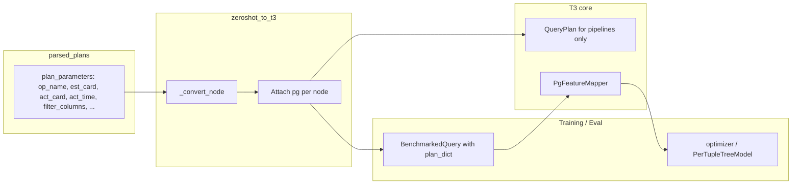

# Completely new Postgres features for zeroshot data

**Goal:** Do not only patch the existing Umbra-style features (e.g. scan_out_card). Instead, define a **dedicated PG/zeroshot feature set** that is built purely from what parsed_plans and the zeroshot mapper provide, and adapt the zeroshot pipeline so we use these features end-to-end for better prediction on zeroshot data.

---

## 1. What parsed_plans and the zeroshot mapper provide

**Source:** Files under e.g. `zero-shot-data/runs/parsed_plans`; structure and fields are defined by the external zero-shot pipeline and by [zeroshot_to_t3.py](src/zeroshot/zeroshot_to_t3.py) / [zeroshot_raw_to_t3.py](src/zeroshot/zeroshot_raw_to_t3.py).

**Per-node (`plan_parameters`):**

| Field                                    | Meaning                                                 | Always present in parsed_plans? |
| ---------------------------------------- | ------------------------------------------------------- | ------------------------------- |
| `op_name`                                | PG operator name (e.g. "Seq Scan", "Hash Join", "Sort") | Yes                             |
| `est_card`                               | Planner estimated output rows                           | Yes (default 1)                 |
| `act_card`                               | Actual output rows                                      | Yes (from EXPLAIN ANALYZE)      |
| `est_width`                              | Estimated tuple width                                   | Yes (default 8)                 |
| `act_time`                               | Actual time for this node (ms)                          | Yes                             |
| `act_startup_cost`                       | Startup time (ms)                                       | Often                           |
| `table`                                  | Table id (scans)                                        | For scans                       |
| `filter_columns`                         | Filter tree (operator, children)                        | When filters exist              |
| `overall_selectivity`                    | From enrichment                                         | Only when enriched              |
| `input_cardinality`                      | From enrichment                                         | Only when enriched              |
| `rows_removed_by_filter`                 | From enrichment                                         | Only when enriched              |
| `est_cost`, `est_startup_cost`           | From raw parser                                         | When from raw                   |
| `act_children_card`, `est_children_card` | Sometimes                                               | Augmented / raw                 |
| `dd_est_card`, `dd_est_children_card`    | DeepDB augmented                                        | Augmented only                  |

**Structure:** Each plan is a tree: `plan_parameters` + `children`; root may have `plan_runtime` (ms). The zeroshot mapper converts this to Umbra-shaped `operator`, `cardinality`, `left`/`right`/`input`, etc., but **does not** currently attach the original `plan_parameters` to the converted nodes, so the core never sees `est_card` vs `act_card`, `act_time` per node, or raw `filter_columns` for feature extraction.

---

## 2. Why dedicated PG features make sense

- **Semantic match:** Umbra features assume input_card, output_card, pipeline_scan_card, percentages. For zeroshot we often have only output card (scans), no schema, and pipeline_scan_card = 1. Forcing that into the Umbra vector gives wrong scale and meaning.
- **Use all available signal:** Parsed_plans provide `est_card`, `act_card`, `act_time`, `act_startup_cost`, `est_width`, `op_name`, `filter_columns` (structure), and optionally enrichment fields. A feature set that uses **only** these fields is always well-defined for zeroshot and matches what we actually have.
- **Single responsibility:** Zeroshot training and inference use PG features only; Umbra/Postgres-with-schema can keep using the existing FeatureMapper. No mixing of two semantics in one vector.

---

## 3. Proposed design: PG feature set + mapper adaptation

### 3.1 New PG features in [src/features.py](src/features.py) (or new file [src/pg_features.py](src/pg_features.py))

Define a **separate** feature set and mapper, not an extension of the current one:

- **PgFeature** (enum): All features derivable from parsed_plans / zeroshot mapper, e.g.:
  - **Per-operator (aggregated per pipeline):**  
  `pg_est_card_sum`, `pg_est_card_max`, `pg_act_card_sum`, `pg_act_card_max`, `pg_act_time_sum`, `pg_act_time_max`, `pg_est_width_avg`, `pg_act_startup_sum`,  
  operator-type counts: `pg_num_scan`, `pg_num_join`, `pg_num_sort`, `pg_num_agg`, `pg_num_temp`, `pg_num_select`,  
  scan-specific: `pg_scan_act_card_sum`, `pg_scan_est_card_sum`, `pg_scan_has_filter`, `pg_filter_and_count`, `pg_filter_or_count`, `pg_filter_compare_count`, `pg_filter_like_count`, `pg_filter_in_count`, `pg_overall_selectivity` (when present), `pg_table_id` (or 0).
  - **Pipeline-level:** `pg_pipeline_act_time_ms`, `pg_pipeline_num_ops`, `pg_pipeline_root_act_card`, etc.
- **PgFeatureMapper** (class):
  - **Input:** A T3 plan dict that has, for each node in `plan`, an attached **PG payload** (e.g. `node["pg"]` = original `plan_parameters`). Pipeline structure from `analyzePlanPipelines` (same as today).
  - **Output:** Same interface as current FeatureMapper: `get_pipeline_estimation_matrix(plan)` returns one vector per pipeline (same shape as needed for training and for `PerTupleTreeModel`). So each row is a fixed-length vector of PG-only features for that pipeline.
  - **Computation:** Walk `analyzePlanPipelines`; for each pipeline, collect the set of operator ids, then walk the tree in `plan["plan"]` to find each node by `analyzePlanId` and read `node["pg"]`; from `pg` extract `op_name`, `est_card`, `act_card`, `act_time`, `est_width`, `filter_columns`, etc.; aggregate (sum/max/avg/count) into the fixed PgFeature vector for that pipeline. Filter structure from `filter_columns` can be summarized by counts (AND/OR/compare/like/in nodes) via a small recursive helper.
- **Fixed vector length:** Enumerate all PgFeature dimensions once (e.g. in `PgQualifiedFeature.enumerate_features()` or equivalent) so every pipeline gets a vector of the same length; missing data (e.g. no filter) -> 0 or a default.

### 3.2 Adapt [src/zeroshot/zeroshot_to_t3.py](src/zeroshot/zeroshot_to_t3.py)

- **Preserve PG payload on each node:** In `_convert_node`, after building the Umbra-shaped `out` dict, set `out["pg"] = copy of plan_parameters` (or a minimal dict with only the keys needed for PgFeatureMapper: `op_name`, `est_card`, `act_card`, `act_time`, `est_width`, `act_startup_cost`, `table`, `filter_columns`, `overall_selectivity`, `input_cardinality` when present). Do not strip fields; let PgFeatureMapper ignore what it doesn't need.
- **Return / store the full converted plan:** `zeroshot_plan_to_t3` already returns a dict with `plan`, `analyzePlanPipelines`, etc. That dict now contains `plan["plan"]` with every node having `pg`. So the same dict can be passed to PgFeatureMapper.get_pipeline_estimation_matrix(plan_dict).

### 3.3 Use PG features in zeroshot training and inference

- **BenchmarkedQuery:** Add an optional field, e.g. `plan_dict: Optional[dict] = None`. When loading from zeroshot, set `plan_dict = converted` (the result of `zeroshot_plan_to_t3`) so we keep the T3 plan with `pg` on each node.
- **get_feature_matrix:** When the mapper is PgFeatureMapper (or when `plan_dict` is not None and a PG path is requested), call `feature_mapper.get_pipeline_estimation_matrix(self.plan_dict)` instead of `get_pipeline_estimation_matrix(self.query_plan)`. So the interface can be: `get_feature_matrix(feature_mapper, plan_dict=None)` where the caller passes `self.plan_dict` when present; or `get_feature_matrix` checks for `isinstance(feature_mapper, PgFeatureMapper)` and uses `self.plan_dict` when available. Avoid caching one matrix per query regardless of mapper (e.g. cache keyed by mapper class or don't cache when using plan_dict).
- **Training scripts** ([training_zeroshot.py](src/zeroshot/training_zeroshot.py), [training_zeroshot_tpch_holdout.py](src/zeroshot/training_zeroshot_tpch_holdout.py), etc.): Use `PgFeatureMapper()` instead of `FeatureMapper()`, and ensure BenchmarkedQuery is built with `plan_dict=converted`. Targets (pipeline runtime or per-tuple) stay the same; only the feature vector is PG-native.
- **Models:** `PerTupleTreeModel` (and others used in zeroshot) keep using the same API; they just receive a different feature matrix when the query was loaded from zeroshot and the mapper is PgFeatureMapper. For zeroshot-only models, the model holds a PgFeatureMapper and all queries have plan_dict set.
- **Pipeline scan size for per-tuple target:** Today `get_pipeline_scan_sizes` is used to convert per-tuple prediction back to runtime. For PG features there is no "pipeline_scan_cardinality" from the Umbra plan. Options: (1) define pipeline scan size for PG as the sum of `act_card` of scan operators in that pipeline (or max), and have PgFeatureMapper expose `get_pipeline_scan_sizes(plan_dict)` using that definition; (2) or keep using the existing QueryPlan for that one number by setting inputCardinality from output when unknown (as in the previous plan), so the existing helper still works. (1) keeps the PG path self-contained.

---

## 4. Data flow with dedicated PG features

---

## 5. Concrete PG feature list (candidate)

Extract **all** of the following from each node's `pg` (plan_parameters) and aggregate per pipeline so the vector is fixed length:

- **Cardinality:** sum/max of `est_card`, `act_card` over pipeline ops; for scan ops only: sum/max `act_card`, `est_card`.
- **Time:** sum/max of `act_time`, `act_startup_cost` (ms).
- **Width:** avg/sum of `est_width`.
- **Operator counts:** number of nodes with op_name in {Seq Scan, Index Scan, ...}, {Hash Join, Nested Loop, ...}, {Sort}, {Aggregate, ...}, {Hash, Materialize}, {Gather, Limit, ...}.
- **Filter (scans):** for each scan, from `filter_columns` tree: count of AND, OR, compare, like, in, between; binary has_filter; when present use `overall_selectivity`.
- **Table:** for scans, `table` id or 0 (or hash to a small set of bins if many tables).
- **Pipeline-level:** pipeline duration (from analyzePlanPipelines), root node's `act_card`, number of operators in pipeline.

All of these are available from parsed_plans or the zeroshot mapper; no Umbra/schema fields required.

---

## 6. Implementation checklist (high level)

- **features.py or pg_features.py:** Define `PgFeature`, `PgQualifiedFeature` (if needed), and `PgFeatureMapper` with `get_pipeline_estimation_matrix(plan_dict)`, `get_names()`, and `get_pipeline_scan_sizes(plan_dict)` (using PG scan output cards). Implement aggregation from `plan["plan"]` + `analyzePlanPipelines` + `node["pg"]`.
- **zeroshot_to_t3.py:** In `_convert_node`, set `out["pg"] = dict(p)` (or a copy of plan_parameters) for every node. Ensure placeholder nodes get a minimal `pg` (e.g. op_name, zero cards) so PgFeatureMapper can still iterate.
- **BenchmarkedQuery (optimizer.py):** Add optional `plan_dict`; in `get_feature_matrix(feature_mapper)` (or a small variant), when mapper is PgFeatureMapper and plan_dict is set, call mapper with plan_dict and do not cache that result under the same key as Umbra matrix.
- **Zeroshot loaders:** In `load_benchmarked_queries_from_zeroshot` and similar, pass `plan_dict=converted` into BenchmarkedQuery.
- **Zeroshot training/eval scripts:** Use `PgFeatureMapper` and ensure PerTupleTreeModel (or equivalent) uses the same mapper and, when needed, `get_pipeline_scan_sizes` from PgFeatureMapper for zeroshot queries.
- **Docs:** Update zeroshot and feature docs to describe the PG feature set and when it is used (zeroshot path only).

---

## 7. References

- [src/features.py](src/features.py) — Current Umbra FeatureMapper (unchanged for non-zeroshot).
- [src/zeroshot/zeroshot_to_t3.py](src/zeroshot/zeroshot_to_t3.py) — `_convert_node`, `zeroshot_plan_to_t3`; add `pg` to each node.
- [src/optimizer.py](src/optimizer.py) — BenchmarkedQuery, get_feature_matrix, get_pipeline_runtime_data.
- [src/model.py](src/model.py) — PerTupleTreeModel, get_feature_matrix, get_pipeline_scan_sizes.
- [src/zeroshot/training_zeroshot_tpch_holdout.py](src/zeroshot/training_zeroshot_tpch_holdout.py) — Where FeatureMapper and get_per_tuple_pipeline_runtime_data are used.
- [docs/zeroshot_parsed_to_umbra.md](docs/zeroshot_parsed_to_umbra.md) — parsed_plans shape.

