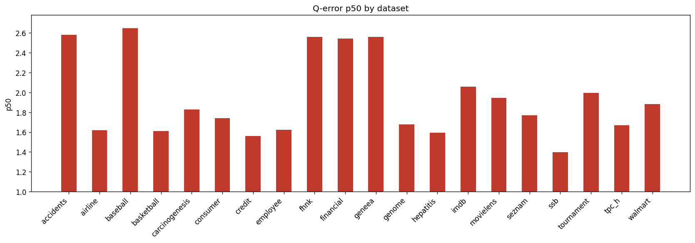

# Holdout Augmented Q-Error Results

**Datasets:** 20  |  **Total queries:** 170,362

## Results by dataset

| Dataset | Queries | avg | p50 | p90 | min | max |
|---------|--------:|----:|----:|----:|----:|----:|
| accidents | 7,195 | 6.1669 | 2.5784 | 17.7013 | 1.0002 | 65.9413 |
| airline | 8,238 | 3.3546 | 1.6170 | 7.1979 | 1.0000 | 140.0905 |
| baseball | 6,970 | 4.2096 | 2.6482 | 8.2703 | 1.0001 | 142.1665 |
| basketball | 5,845 | 2.3319 | 1.6095 | 4.5284 | 1.0001 | 152.9029 |
| carcinogenesis | 7,210 | 3.5472 | 1.8290 | 8.1506 | 1.0001 | 32.5866 |
| consumer | 9,355 | 2.0438 | 1.7415 | 3.3285 | 1.0001 | 13.2776 |
| credit | 9,201 | 2.8917 | 1.5619 | 4.5604 | 1.0002 | 82.7767 |
| employee | 7,756 | 2.0981 | 1.6249 | 3.6549 | 1.0001 | 21.3109 |
| fhnk | 7,965 | 3.6552 | 2.5612 | 7.6331 | 1.0000 | 19.0912 |
| financial | 8,246 | 2.8447 | 2.5418 | 4.6065 | 1.0000 | 24.2263 |
| geneea | 6,515 | 3.1339 | 2.5604 | 5.6346 | 1.0000 | 41.3981 |
| genome | 7,969 | 2.1062 | 1.6757 | 3.4351 | 1.0002 | 14.7885 |
| hepatitis | 7,824 | 2.0594 | 1.5940 | 3.2283 | 1.0003 | 10.3583 |
| imdb | 23,574 | 5.6649 | 2.0596 | 7.3942 | 1.0001 | 255.7284 |
| movielens | 7,873 | 2.4483 | 1.9442 | 4.2448 | 1.0001 | 15.7625 |
| seznam | 7,378 | 2.4345 | 1.7701 | 4.1768 | 1.0000 | 22.6172 |
| ssb | 8,856 | 1.9433 | 1.3994 | 2.8876 | 1.0000 | 19.9273 |
| tournament | 7,786 | 3.3386 | 1.9931 | 6.6755 | 1.0001 | 49.3319 |
| tpc_h | 6,221 | 2.3831 | 1.6703 | 4.8888 | 1.0002 | 19.0339 |
| walmart | 8,385 | 1.9205 | 1.8811 | 2.6428 | 1.0003 | 7.7691 |

## p50 by dataset

## Averages (over datasets)

| Metric | Value |
|--------|------:|
| **avg** | 3.0288 |
| **p50** | 1.9431 |
| **p90** | 5.7420 |
| **min** | 1.0001 |
| **max** | 57.5543 |
