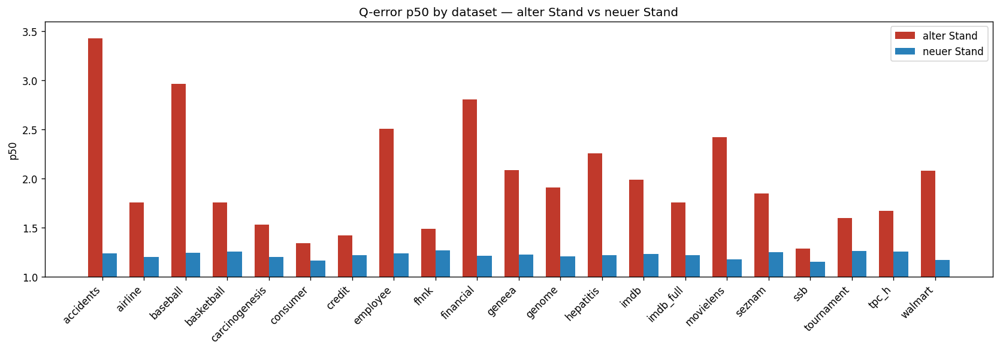

# Holdout-Vergleich: alter Stand vs neuer Stand

## p50 by dataset (grouped bar chart)

## Medians (over datasets)

### alter Stand

| Metric | Value |
|--------|------:|
| **avg** | 2.4368 |
| **p50** | 1.8486 |
| **p90** | 4.6229 |
| **min** | 1.0000 |
| **max** | 27.5287 |

### neuer Stand

| Metric | Value |
|--------|------:|
| **avg** | 1.3424 |
| **p50** | 1.2215 |
| **p90** | 1.7758 |
| **min** | 1.0000 |
| **max** | 15.6188 |
