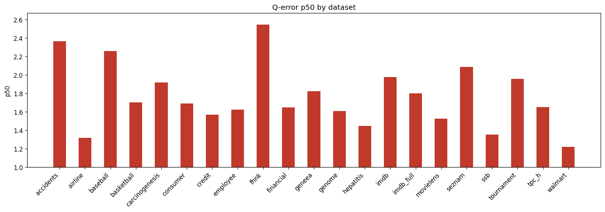

# Holdout Q-Error Results

**Datasets:** 21  |  **Total queries:** 291,424

## Results by dataset

| Dataset | Queries | avg | p50 | p90 | min | max |
|---------|--------:|----:|----:|----:|----:|----:|
| accidents | 10,495 | 5.9253 | 2.3641 | 17.0778 | 1.0002 | 88.0927 |
| airline | 12,323 | 2.2401 | 1.3178 | 4.2975 | 1.0000 | 37.0969 |
| baseball | 10,600 | 3.3243 | 2.2575 | 6.2926 | 1.0000 | 153.2022 |
| basketball | 9,002 | 2.4515 | 1.7003 | 4.6997 | 1.0001 | 323.7189 |
| carcinogenesis | 11,148 | 13.2856 | 1.9181 | 5.6120 | 1.0001 | 4433.1862 |
| consumer | 14,330 | 1.9368 | 1.6901 | 3.0324 | 1.0000 | 9.0723 |
| credit | 14,051 | 2.7860 | 1.5695 | 4.9682 | 1.0001 | 129.8206 |
| employee | 11,092 | 3.1973 | 1.6237 | 4.0237 | 1.0001 | 518.0039 |
| fhnk | 11,070 | 3.3152 | 2.5424 | 6.4188 | 1.0001 | 15.9427 |
| financial | 12,139 | 2.4769 | 1.6476 | 4.0230 | 1.0001 | 43.2239 |
| geneea | 9,945 | 2.9481 | 1.8245 | 5.3522 | 1.0000 | 73.8794 |
| genome | 11,770 | 2.0524 | 1.6060 | 3.2657 | 1.0000 | 15.5000 |
| hepatitis | 10,999 | 1.9163 | 1.4462 | 2.8603 | 1.0002 | 39.1428 |
| imdb | 27,843 | 3.5549 | 1.9761 | 5.5622 | 1.0001 | 130.6671 |
| imdb_full | 43,725 | 2.4583 | 1.7983 | 4.0558 | 1.0000 | 56.1928 |
| movielens | 11,788 | 2.1731 | 1.5270 | 3.8291 | 1.0002 | 17.4647 |
| seznam | 11,356 | 2.8105 | 2.0872 | 5.4033 | 1.0000 | 22.0920 |
| ssb | 13,396 | 1.6883 | 1.3515 | 2.4151 | 1.0001 | 14.0069 |
| tournament | 11,992 | 3.2234 | 1.9573 | 6.2773 | 1.0000 | 74.6603 |
| tpc_h | 9,868 | 2.1890 | 1.6490 | 3.8493 | 1.0001 | 25.2223 |
| walmart | 12,492 | 1.6265 | 1.2216 | 2.3754 | 1.0000 | 17.4344 |

## p50 by dataset

## Averages (over datasets)

| Metric | Value |
|--------|------:|
| **avg** | 3.2181 |
| **p50** | 1.7655 |
| **p90** | 5.0329 |
| **min** | 1.0001 |
| **max** | 297.0297 |
