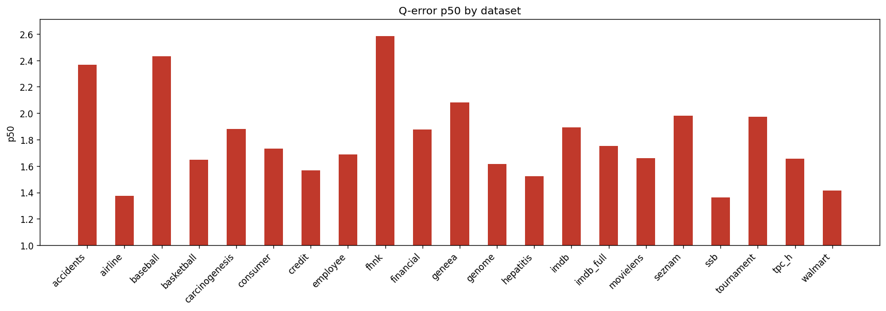

# Holdout Q-Error Results

**Datasets:** 21  |  **Total queries:** 291,424

## Results by dataset

| Dataset | Queries | avg | p50 | p90 | min | max |
|---------|--------:|----:|----:|----:|----:|----:|
| accidents | 10,495 | 5.7451 | 2.3662 | 17.5642 | 1.0003 | 77.8771 |
| airline | 12,323 | 2.5024 | 1.3751 | 4.7432 | 1.0001 | 57.2922 |
| baseball | 10,600 | 3.5732 | 2.4303 | 6.8329 | 1.0001 | 111.6443 |
| basketball | 9,002 | 2.3455 | 1.6473 | 4.5813 | 1.0001 | 407.4323 |
| carcinogenesis | 11,148 | 4.5986 | 1.8800 | 7.9023 | 1.0000 | 691.1017 |
| consumer | 14,330 | 1.9890 | 1.7327 | 3.1652 | 1.0000 | 9.6950 |
| credit | 14,051 | 2.7665 | 1.5687 | 4.7348 | 1.0000 | 107.6871 |
| employee | 11,092 | 2.5574 | 1.6887 | 3.9572 | 1.0000 | 137.8838 |
| fhnk | 11,070 | 3.3432 | 2.5826 | 6.5493 | 1.0000 | 15.5667 |
| financial | 12,139 | 2.4870 | 1.8759 | 3.9116 | 1.0001 | 35.4754 |
| geneea | 9,945 | 2.8887 | 2.0809 | 5.0663 | 1.0001 | 59.0049 |
| genome | 11,770 | 2.0516 | 1.6133 | 3.2325 | 1.0001 | 14.9437 |
| hepatitis | 10,999 | 1.9374 | 1.5222 | 2.8755 | 1.0000 | 22.4362 |
| imdb | 27,843 | 3.8077 | 1.8932 | 5.2293 | 1.0000 | 168.0404 |
| imdb_full | 43,725 | 2.4797 | 1.7523 | 4.1567 | 1.0000 | 51.4454 |
| movielens | 11,788 | 2.2098 | 1.6595 | 3.8471 | 1.0001 | 15.8318 |
| seznam | 11,356 | 2.6545 | 1.9819 | 4.9662 | 1.0000 | 20.0116 |
| ssb | 13,396 | 1.7543 | 1.3626 | 2.5247 | 1.0000 | 15.3618 |
| tournament | 11,992 | 3.2185 | 1.9740 | 6.1614 | 1.0000 | 72.6246 |
| tpc_h | 9,868 | 2.2294 | 1.6555 | 3.9965 | 1.0001 | 23.2488 |
| walmart | 12,492 | 1.7194 | 1.4147 | 2.3740 | 1.0001 | 15.2676 |

## p50 by dataset

## Averages (over datasets)

| Metric | Value |
|--------|------:|
| **avg** | 2.8028 |
| **p50** | 1.8123 |
| **p90** | 5.1606 |
| **min** | 1.0001 |
| **max** | 101.4225 |
