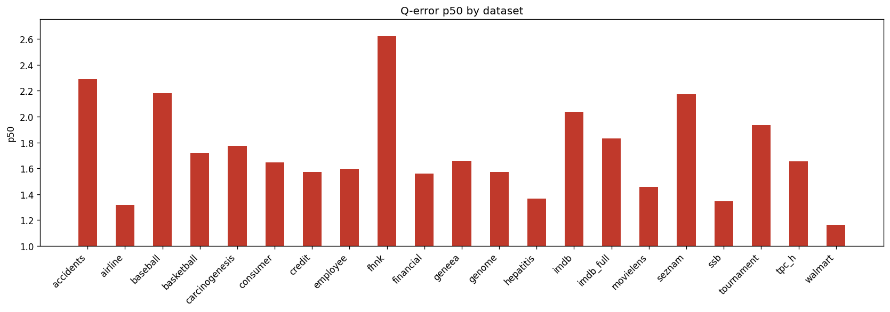

# Holdout Q-Error Results

**Datasets:** 21  |  **Total queries:** 291,424

## Results by dataset

| Dataset | Queries | avg | p50 | p90 | min | max |
|---------|--------:|----:|----:|----:|----:|----:|
| accidents | 10,495 | 5.7889 | 2.2934 | 14.2975 | 1.0001 | 164.2492 |
| airline | 12,323 | 2.1187 | 1.3183 | 3.9867 | 1.0001 | 45.5401 |
| baseball | 10,600 | 3.2703 | 2.1806 | 6.2701 | 1.0001 | 176.3515 |
| basketball | 9,002 | 2.4082 | 1.7219 | 4.3885 | 1.0000 | 405.0653 |
| carcinogenesis | 11,148 | 32.3173 | 1.7725 | 6.4162 | 1.0001 | 12474.7307 |
| consumer | 14,330 | 1.8914 | 1.6447 | 3.0128 | 1.0001 | 8.7134 |
| credit | 14,051 | 2.9037 | 1.5741 | 5.3665 | 1.0000 | 187.5100 |
| employee | 11,092 | 5.1929 | 1.5959 | 4.1238 | 1.0001 | 2146.9138 |
| fhnk | 11,070 | 3.4614 | 2.6213 | 6.6072 | 1.0000 | 21.5049 |
| financial | 12,139 | 2.5136 | 1.5579 | 4.3892 | 1.0001 | 45.8705 |
| geneea | 9,945 | 3.0962 | 1.6584 | 5.8690 | 1.0001 | 91.7098 |
| genome | 11,770 | 2.0457 | 1.5717 | 3.3031 | 1.0000 | 16.0101 |
| hepatitis | 10,999 | 1.9541 | 1.3666 | 2.8556 | 1.0000 | 53.1142 |
| imdb | 27,843 | 3.6996 | 2.0349 | 5.8778 | 1.0000 | 546.4845 |
| imdb_full | 43,725 | 2.4925 | 1.8331 | 4.1796 | 1.0000 | 63.4917 |
| movielens | 11,788 | 2.1155 | 1.4582 | 3.8110 | 1.0001 | 18.4618 |
| seznam | 11,356 | 2.9350 | 2.1730 | 5.9235 | 1.0001 | 33.2869 |
| ssb | 13,396 | 1.6357 | 1.3479 | 2.2805 | 1.0000 | 12.6214 |
| tournament | 11,992 | 3.2596 | 1.9334 | 6.3460 | 1.0001 | 110.2072 |
| tpc_h | 9,868 | 2.2042 | 1.6557 | 3.9290 | 1.0000 | 25.5268 |
| walmart | 12,492 | 1.5668 | 1.1601 | 2.2610 | 1.0000 | 17.0886 |

## p50 by dataset

## Averages (over datasets)

| Metric | Value |
|--------|------:|
| **avg** | 4.2320 |
| **p50** | 1.7368 |
| **p90** | 5.0236 |
| **min** | 1.0001 |
| **max** | 793.5454 |
