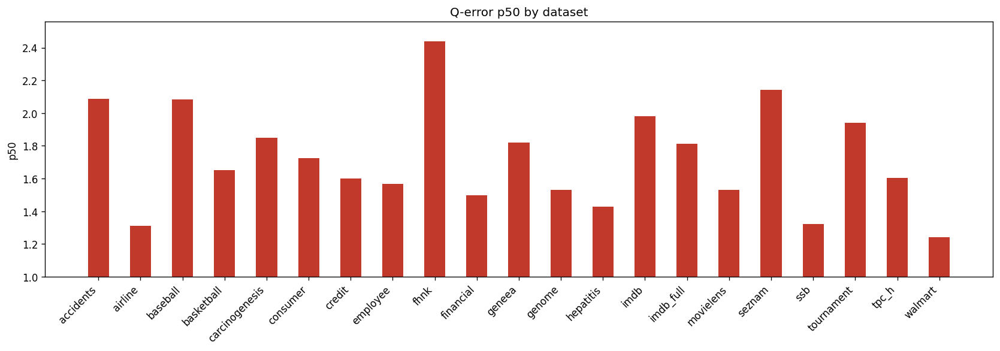

# Holdout Q-Error Results

**Datasets:** 21  |  **Total queries:** 291,424

## Results by dataset

| Dataset | Queries | avg | p50 | p90 | min | max |
|---------|--------:|----:|----:|----:|----:|----:|
| accidents | 10,495 | 6.2359 | 2.0886 | 19.8111 | 1.0003 | 111.6655 |
| airline | 12,323 | 2.3535 | 1.3124 | 4.3938 | 1.0001 | 75.8796 |
| baseball | 10,600 | 3.4174 | 2.0833 | 6.0538 | 1.0000 | 127.7935 |
| basketball | 9,002 | 2.3642 | 1.6509 | 4.2722 | 1.0000 | 654.9625 |
| carcinogenesis | 11,148 | 3.0164 | 1.8480 | 6.0025 | 1.0001 | 56.2681 |
| consumer | 14,330 | 1.9682 | 1.7233 | 3.1520 | 1.0001 | 9.1058 |
| credit | 14,051 | 2.7497 | 1.6021 | 4.9849 | 1.0000 | 104.6389 |
| employee | 11,092 | 2.7825 | 1.5671 | 5.2398 | 1.0000 | 37.1420 |
| fhnk | 11,070 | 3.1563 | 2.4372 | 5.9800 | 1.0000 | 20.0820 |
| financial | 12,139 | 2.4315 | 1.4995 | 4.1314 | 1.0000 | 45.6554 |
| geneea | 9,945 | 2.9249 | 1.8209 | 5.7595 | 1.0000 | 69.1700 |
| genome | 11,770 | 1.9444 | 1.5306 | 3.0594 | 1.0000 | 14.7997 |
| hepatitis | 10,999 | 1.8490 | 1.4299 | 2.8686 | 1.0000 | 20.1312 |
| imdb | 27,843 | 3.6300 | 1.9828 | 5.0778 | 1.0000 | 1308.2940 |
| imdb_full | 43,725 | 2.5492 | 1.8137 | 4.1760 | 1.0000 | 56.4864 |
| movielens | 11,788 | 2.1156 | 1.5297 | 3.6848 | 1.0000 | 15.6768 |
| seznam | 11,356 | 2.8244 | 2.1418 | 5.4747 | 1.0001 | 17.8605 |
| ssb | 13,396 | 1.6960 | 1.3225 | 2.4864 | 1.0000 | 13.9415 |
| tournament | 11,992 | 3.4999 | 1.9413 | 6.8888 | 1.0000 | 76.5363 |
| tpc_h | 9,868 | 2.0921 | 1.6056 | 3.4842 | 1.0001 | 20.7698 |
| walmart | 12,492 | 1.5211 | 1.2402 | 1.9054 | 1.0000 | 15.2193 |

## p50 by dataset

## Averages (over datasets)

| Metric | Value |
|--------|------:|
| **avg** | 2.7201 |
| **p50** | 1.7224 |
| **p90** | 5.1851 |
| **min** | 1.0000 |
| **max** | 136.7657 |
