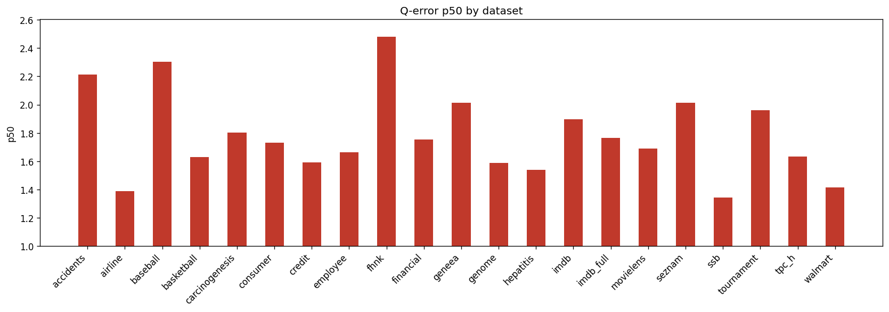

# Holdout Q-Error Results

**Datasets:** 21  |  **Total queries:** 291,424

## Results by dataset

| Dataset | Queries | avg | p50 | p90 | min | max |
|---------|--------:|----:|----:|----:|----:|----:|
| accidents | 10,495 | 6.1118 | 2.2137 | 19.4658 | 1.0000 | 82.3749 |
| airline | 12,323 | 2.8934 | 1.3870 | 5.7148 | 1.0000 | 121.8106 |
| baseball | 10,600 | 3.5666 | 2.3046 | 6.3839 | 1.0003 | 111.3667 |
| basketball | 9,002 | 2.3672 | 1.6294 | 4.4624 | 1.0001 | 589.8418 |
| carcinogenesis | 11,148 | 3.3706 | 1.8043 | 7.5765 | 1.0000 | 63.8428 |
| consumer | 14,330 | 1.9991 | 1.7303 | 3.2351 | 1.0001 | 9.7487 |
| credit | 14,051 | 2.7361 | 1.5921 | 4.6653 | 1.0000 | 85.1956 |
| employee | 11,092 | 2.1836 | 1.6646 | 3.3974 | 1.0000 | 33.9021 |
| fhnk | 11,070 | 3.2036 | 2.4803 | 6.2068 | 1.0000 | 17.3038 |
| financial | 12,139 | 2.3936 | 1.7543 | 3.6494 | 1.0001 | 41.1599 |
| geneea | 9,945 | 2.8771 | 2.0127 | 5.2918 | 1.0000 | 57.3071 |
| genome | 11,770 | 2.0006 | 1.5881 | 3.1466 | 1.0000 | 13.7255 |
| hepatitis | 10,999 | 1.9028 | 1.5376 | 2.8619 | 1.0001 | 17.2830 |
| imdb | 27,843 | 3.6946 | 1.8951 | 5.1253 | 1.0000 | 213.9892 |
| imdb_full | 43,725 | 2.5346 | 1.7645 | 4.1857 | 1.0000 | 46.6858 |
| movielens | 11,788 | 2.2012 | 1.6904 | 3.8379 | 1.0000 | 14.3995 |
| seznam | 11,356 | 2.6294 | 2.0132 | 4.9010 | 1.0000 | 17.4840 |
| ssb | 13,396 | 1.7849 | 1.3431 | 2.6598 | 1.0001 | 16.4451 |
| tournament | 11,992 | 3.3703 | 1.9606 | 6.6218 | 1.0001 | 58.0961 |
| tpc_h | 9,868 | 2.2111 | 1.6328 | 3.8789 | 1.0000 | 20.7707 |
| walmart | 12,492 | 1.6619 | 1.4132 | 2.0793 | 1.0000 | 14.7108 |

## p50 by dataset

## Averages (over datasets)

| Metric | Value |
|--------|------:|
| **avg** | 2.7473 |
| **p50** | 1.7815 |
| **p90** | 5.2070 |
| **min** | 1.0000 |
| **max** | 78.4497 |
