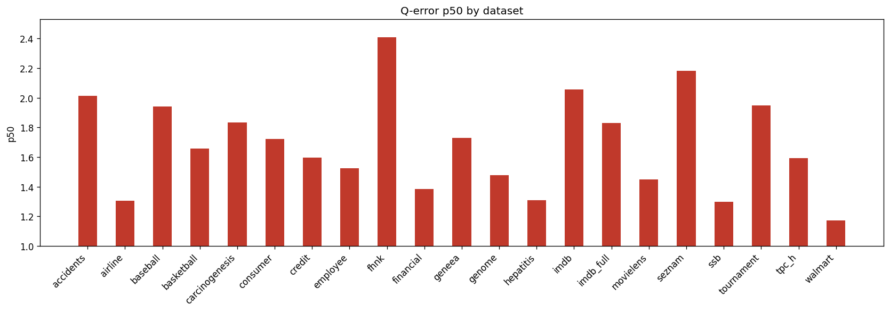

# Holdout Q-Error Results

**Datasets:** 21  |  **Total queries:** 291,424

## Results by dataset

| Dataset | Queries | avg | p50 | p90 | min | max |
|---------|--------:|----:|----:|----:|----:|----:|
| accidents | 10,495 | 6.1785 | 2.0150 | 17.9147 | 1.0004 | 136.3656 |
| airline | 12,323 | 2.1771 | 1.3052 | 3.7503 | 1.0000 | 71.4739 |
| baseball | 10,600 | 3.3188 | 1.9424 | 6.4388 | 1.0001 | 133.7350 |
| basketball | 9,002 | 2.3569 | 1.6582 | 4.1403 | 1.0000 | 686.8451 |
| carcinogenesis | 11,148 | 3.0912 | 1.8330 | 6.4157 | 1.0000 | 135.3162 |
| consumer | 14,330 | 1.9613 | 1.7231 | 3.1230 | 1.0000 | 8.7082 |
| credit | 14,051 | 2.8276 | 1.5973 | 5.2521 | 1.0000 | 137.9869 |
| employee | 11,092 | 3.0388 | 1.5235 | 5.5518 | 1.0001 | 35.2854 |
| fhnk | 11,070 | 3.1015 | 2.4103 | 6.0004 | 1.0001 | 17.6183 |
| financial | 12,139 | 2.5130 | 1.3860 | 4.6344 | 1.0000 | 47.7066 |
| geneea | 9,945 | 2.9988 | 1.7313 | 6.1538 | 1.0000 | 79.9204 |
| genome | 11,770 | 1.9281 | 1.4800 | 2.9855 | 1.0001 | 16.0471 |
| hepatitis | 10,999 | 1.8165 | 1.3094 | 2.8395 | 1.0000 | 24.1506 |
| imdb | 27,843 | 4.8140 | 2.0557 | 5.7332 | 1.0000 | 6520.9519 |
| imdb_full | 43,725 | 2.5579 | 1.8295 | 4.2544 | 1.0001 | 64.7172 |
| movielens | 11,788 | 2.1004 | 1.4506 | 3.7442 | 1.0000 | 17.0897 |
| seznam | 11,356 | 2.9573 | 2.1809 | 5.8835 | 1.0001 | 19.6022 |
| ssb | 13,396 | 1.6417 | 1.2999 | 2.4102 | 1.0001 | 12.6132 |
| tournament | 11,992 | 3.5384 | 1.9472 | 6.8704 | 1.0000 | 89.4331 |
| tpc_h | 9,868 | 2.0667 | 1.5932 | 3.4215 | 1.0000 | 25.3093 |
| walmart | 12,492 | 1.4490 | 1.1733 | 1.7968 | 1.0001 | 13.9625 |

## p50 by dataset

## Averages (over datasets)

| Metric | Value |
|--------|------:|
| **avg** | 2.7825 |
| **p50** | 1.6879 |
| **p90** | 5.2055 |
| **min** | 1.0001 |
| **max** | 394.9923 |
