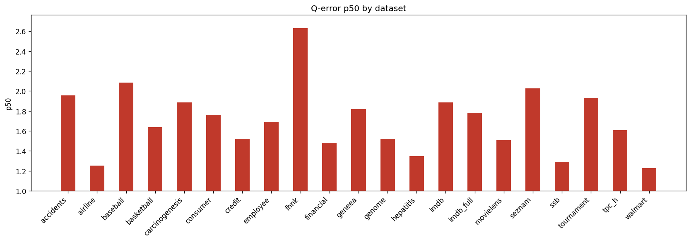

# Holdout Q-Error Results

**Datasets:** 21  |  **Total queries:** 291,424

## Results by dataset

| Dataset | Queries | avg | p50 | p90 | min | max |
|---------|--------:|----:|----:|----:|----:|----:|
| accidents | 10,495 | 5.7236 | 1.9580 | 14.1726 | 1.0002 | 247.4743 |
| airline | 12,323 | 1.9671 | 1.2539 | 3.0267 | 1.0000 | 45.7902 |
| baseball | 10,600 | 3.3453 | 2.0851 | 5.8510 | 1.0002 | 115.0381 |
| basketball | 9,002 | 2.3115 | 1.6377 | 4.1647 | 1.0000 | 500.1801 |
| carcinogenesis | 11,148 | 9.1557 | 1.8844 | 7.3626 | 1.0002 | 4034.5066 |
| consumer | 14,330 | 1.9978 | 1.7612 | 3.2447 | 1.0001 | 9.6253 |
| credit | 14,051 | 2.5134 | 1.5238 | 4.5656 | 1.0000 | 71.0823 |
| employee | 11,092 | 23.9008 | 1.6915 | 7.1837 | 1.0000 | 19653.0153 |
| fhnk | 11,070 | 3.5266 | 2.6317 | 7.0129 | 1.0016 | 21.6587 |
| financial | 12,139 | 2.5853 | 1.4755 | 4.3189 | 1.0000 | 51.7013 |
| geneea | 9,945 | 3.3112 | 1.8194 | 6.3552 | 1.0000 | 211.9756 |
| genome | 11,770 | 1.9498 | 1.5211 | 3.0964 | 1.0000 | 15.2268 |
| hepatitis | 10,999 | 1.8117 | 1.3482 | 2.9468 | 1.0000 | 25.3134 |
| imdb | 27,843 | 3.4138 | 1.8853 | 4.9959 | 1.0001 | 125.9265 |
| imdb_full | 43,725 | 2.5661 | 1.7831 | 4.2805 | 1.0000 | 59.1015 |
| movielens | 11,788 | 2.0590 | 1.5111 | 3.5264 | 1.0000 | 17.4243 |
| seznam | 11,356 | 2.7037 | 2.0271 | 5.2133 | 1.0000 | 17.6929 |
| ssb | 13,396 | 1.6758 | 1.2881 | 2.4138 | 1.0000 | 22.3027 |
| tournament | 11,992 | 3.2908 | 1.9272 | 6.3583 | 1.0000 | 64.0253 |
| tpc_h | 9,868 | 2.1068 | 1.6095 | 3.4812 | 1.0000 | 28.4575 |
| walmart | 12,492 | 1.5327 | 1.2276 | 2.0037 | 1.0000 | 15.4583 |

## p50 by dataset

## Averages (over datasets)

| Metric | Value |
|--------|------:|
| **avg** | 3.9737 |
| **p50** | 1.7072 |
| **p90** | 5.0274 |
| **min** | 1.0001 |
| **max** | 1207.2846 |
