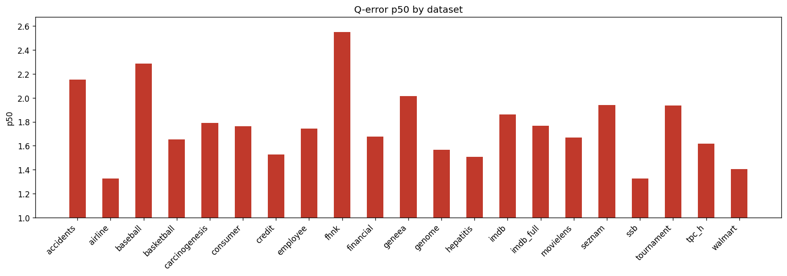

# Holdout Q-Error Results

**Datasets:** 21  |  **Total queries:** 291,424

## Results by dataset

| Dataset | Queries | avg | p50 | p90 | min | max |
|---------|--------:|----:|----:|----:|----:|----:|
| accidents | 10,495 | 5.8509 | 2.1534 | 17.1203 | 1.0004 | 175.1833 |
| airline | 12,323 | 2.3621 | 1.3248 | 4.2758 | 1.0001 | 64.8390 |
| baseball | 10,600 | 3.5567 | 2.2840 | 6.3843 | 1.0003 | 99.2666 |
| basketball | 9,002 | 2.3595 | 1.6524 | 4.5126 | 1.0001 | 419.2789 |
| carcinogenesis | 11,148 | 4.1159 | 1.7913 | 8.3924 | 1.0000 | 441.6743 |
| consumer | 14,330 | 2.0180 | 1.7623 | 3.2867 | 1.0002 | 10.2154 |
| credit | 14,051 | 2.4735 | 1.5260 | 4.4264 | 1.0000 | 60.4567 |
| employee | 11,092 | 4.3984 | 1.7432 | 6.6208 | 1.0001 | 1282.7861 |
| fhnk | 11,070 | 3.4469 | 2.5470 | 7.0302 | 1.0001 | 17.6324 |
| financial | 12,139 | 2.4213 | 1.6780 | 3.8473 | 1.0000 | 41.3469 |
| geneea | 9,945 | 2.9756 | 2.0154 | 5.4776 | 1.0001 | 86.6658 |
| genome | 11,770 | 1.9859 | 1.5657 | 3.1607 | 1.0000 | 14.8069 |
| hepatitis | 10,999 | 1.9118 | 1.5091 | 2.9408 | 1.0001 | 19.5215 |
| imdb | 27,843 | 3.8052 | 1.8626 | 5.1766 | 1.0000 | 166.2658 |
| imdb_full | 43,725 | 2.5559 | 1.7670 | 4.3225 | 1.0001 | 51.0128 |
| movielens | 11,788 | 2.1399 | 1.6683 | 3.6557 | 1.0001 | 13.7021 |
| seznam | 11,356 | 2.5542 | 1.9401 | 4.8015 | 1.0000 | 18.1308 |
| ssb | 13,396 | 1.7594 | 1.3268 | 2.5516 | 1.0000 | 17.3655 |
| tournament | 11,992 | 3.2302 | 1.9366 | 6.3100 | 1.0000 | 54.6895 |
| tpc_h | 9,868 | 2.0768 | 1.6171 | 3.4173 | 1.0002 | 24.8846 |
| walmart | 12,492 | 1.6706 | 1.4056 | 2.1448 | 1.0000 | 14.9178 |

## p50 by dataset

## Averages (over datasets)

| Metric | Value |
|--------|------:|
| **avg** | 2.8414 |
| **p50** | 1.7656 |
| **p90** | 5.2312 |
| **min** | 1.0001 |
| **max** | 147.3639 |
