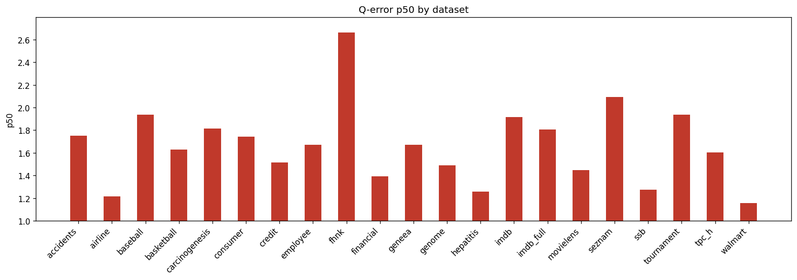

# Holdout Q-Error Results

**Datasets:** 21  |  **Total queries:** 291,424

## Results by dataset

| Dataset | Queries | avg | p50 | p90 | min | max |
|---------|--------:|----:|----:|----:|----:|----:|
| accidents | 10,495 | 6.0540 | 1.7532 | 14.1181 | 1.0000 | 402.3492 |
| airline | 12,323 | 1.8719 | 1.2138 | 2.6576 | 1.0000 | 59.6371 |
| baseball | 10,600 | 3.3352 | 1.9382 | 6.0874 | 1.0000 | 134.6445 |
| basketball | 9,002 | 2.2912 | 1.6286 | 4.0876 | 1.0001 | 430.6597 |
| carcinogenesis | 11,148 | 36.5772 | 1.8130 | 7.8757 | 1.0002 | 21125.3627 |
| consumer | 14,330 | 1.9786 | 1.7429 | 3.1620 | 1.0000 | 9.4677 |
| credit | 14,051 | 2.5823 | 1.5158 | 4.5112 | 1.0000 | 105.2842 |
| employee | 11,092 | 86.7784 | 1.6726 | 7.7113 | 1.0000 | 89760.1201 |
| fhnk | 11,070 | 3.7308 | 2.6636 | 7.2069 | 1.0000 | 25.9921 |
| financial | 12,139 | 2.7789 | 1.3932 | 4.7931 | 1.0001 | 69.5286 |
| geneea | 9,945 | 3.6378 | 1.6718 | 6.8540 | 1.0001 | 418.3090 |
| genome | 11,770 | 1.9400 | 1.4896 | 3.0862 | 1.0001 | 16.7826 |
| hepatitis | 10,999 | 1.7657 | 1.2587 | 2.8505 | 1.0000 | 29.8664 |
| imdb | 27,843 | 3.2765 | 1.9145 | 5.1340 | 1.0000 | 108.7563 |
| imdb_full | 43,725 | 2.6117 | 1.8074 | 4.3885 | 1.0000 | 68.9537 |
| movielens | 11,788 | 2.0818 | 1.4467 | 3.6396 | 1.0000 | 21.1497 |
| seznam | 11,356 | 2.8382 | 2.0909 | 5.5636 | 1.0001 | 19.1950 |
| ssb | 13,396 | 1.6003 | 1.2760 | 2.2674 | 1.0000 | 18.1657 |
| tournament | 11,992 | 3.3245 | 1.9387 | 6.2946 | 1.0001 | 67.8120 |
| tpc_h | 9,868 | 2.1276 | 1.6020 | 3.5800 | 1.0003 | 29.3847 |
| walmart | 12,492 | 1.4234 | 1.1555 | 2.0087 | 1.0000 | 29.2036 |

## p50 by dataset

## Averages (over datasets)

| Metric | Value |
|--------|------:|
| **avg** | 8.3146 |
| **p50** | 1.6660 |
| **p90** | 5.1370 |
| **min** | 1.0001 |
| **max** | 5378.6012 |
