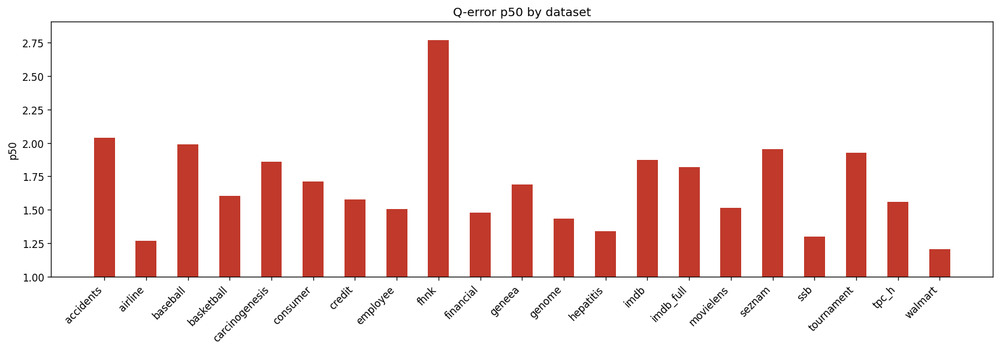

# Holdout Q-Error Results

**Datasets:** 21  |  **Total queries:** 291,424

## Results by dataset

| Dataset | Queries | avg | p50 | p90 | min | max |
|---------|--------:|----:|----:|----:|----:|----:|
| accidents | 10,495 | 6.4053 | 2.0401 | 19.1284 | 1.0000 | 176.3088 |
| airline | 12,323 | 2.2286 | 1.2683 | 3.9570 | 1.0002 | 90.8069 |
| baseball | 10,600 | 3.1858 | 1.9886 | 5.2536 | 1.0001 | 145.6707 |
| basketball | 9,002 | 2.2948 | 1.6050 | 4.1782 | 1.0002 | 553.4587 |
| carcinogenesis | 11,148 | 11.7485 | 1.8605 | 6.2005 | 1.0002 | 12278.9463 |
| consumer | 14,330 | 1.9550 | 1.7133 | 3.1100 | 1.0000 | 9.3243 |
| credit | 14,051 | 2.6654 | 1.5775 | 4.8790 | 1.0000 | 103.5088 |
| employee | 11,092 | 9.3560 | 1.5074 | 3.5170 | 1.0001 | 12081.7837 |
| fhnk | 11,070 | 3.3116 | 2.7680 | 6.2311 | 1.0002 | 59.5393 |
| financial | 12,139 | 2.5286 | 1.4814 | 4.3080 | 1.0002 | 88.1333 |
| geneea | 9,945 | 3.0580 | 1.6899 | 5.8444 | 1.0002 | 214.9816 |
| genome | 11,770 | 1.8893 | 1.4361 | 2.9398 | 1.0000 | 16.7994 |
| hepatitis | 10,999 | 2.5383 | 1.3383 | 3.0357 | 1.0000 | 491.8119 |
| imdb | 27,843 | 3.4926 | 1.8718 | 5.0998 | 1.0000 | 143.4097 |
| imdb_full | 43,725 | 2.4965 | 1.8185 | 4.1327 | 1.0000 | 65.9626 |
| movielens | 11,788 | 2.0535 | 1.5139 | 3.5284 | 1.0000 | 18.1633 |
| seznam | 11,356 | 2.6220 | 1.9541 | 5.1918 | 1.0000 | 16.7798 |
| ssb | 13,396 | 1.6532 | 1.3022 | 2.3961 | 1.0000 | 23.9574 |
| tournament | 11,992 | 3.1732 | 1.9286 | 6.1083 | 1.0000 | 65.3817 |
| tpc_h | 9,868 | 2.0589 | 1.5614 | 3.3806 | 1.0000 | 28.1304 |
| walmart | 12,492 | 1.4416 | 1.2051 | 1.8572 | 1.0000 | 11.7372 |

## p50 by dataset

## Averages (over datasets)

| Metric | Value |
|--------|------:|
| **avg** | 3.4360 |
| **p50** | 1.6871 |
| **p90** | 4.9656 |
| **min** | 1.0001 |
| **max** | 1270.6950 |
