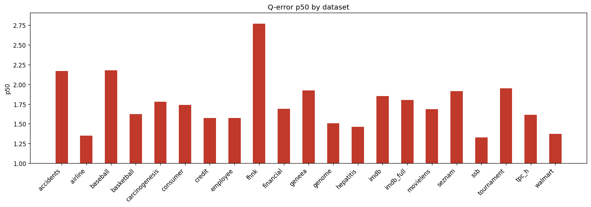

# Holdout Q-Error Results

**Datasets:** 21  |  **Total queries:** 291,424

## Results by dataset

| Dataset | Queries | avg | p50 | p90 | min | max |
|---------|--------:|----:|----:|----:|----:|----:|
| accidents | 10,495 | 6.0903 | 2.1704 | 18.4060 | 1.0001 | 102.9408 |
| airline | 12,323 | 2.5260 | 1.3484 | 4.4122 | 1.0001 | 83.6391 |
| baseball | 10,600 | 3.4017 | 2.1800 | 5.7166 | 1.0001 | 111.8469 |
| basketball | 9,002 | 2.3068 | 1.6219 | 4.4093 | 1.0001 | 451.3967 |
| carcinogenesis | 11,148 | 3.8584 | 1.7805 | 8.3001 | 1.0000 | 653.6191 |
| consumer | 14,330 | 1.9945 | 1.7410 | 3.2363 | 1.0000 | 9.5426 |
| credit | 14,051 | 2.8169 | 1.5738 | 4.5695 | 1.0002 | 70.3399 |
| employee | 11,092 | 2.4876 | 1.5739 | 3.4961 | 1.0000 | 558.4547 |
| fhnk | 11,070 | 3.2283 | 2.7689 | 5.7617 | 1.0001 | 25.9999 |
| financial | 12,139 | 2.4380 | 1.6896 | 3.7882 | 1.0001 | 73.9545 |
| geneea | 9,945 | 2.8084 | 1.9227 | 5.3787 | 1.0003 | 58.9706 |
| genome | 11,770 | 1.9544 | 1.5085 | 3.0765 | 1.0000 | 14.6884 |
| hepatitis | 10,999 | 1.9112 | 1.4628 | 3.0343 | 1.0001 | 20.3286 |
| imdb | 27,843 | 3.8267 | 1.8498 | 5.0844 | 1.0000 | 177.8645 |
| imdb_full | 43,725 | 2.4734 | 1.8016 | 4.0262 | 1.0000 | 46.6644 |
| movielens | 11,788 | 2.1268 | 1.6843 | 3.5857 | 1.0001 | 14.4419 |
| seznam | 11,356 | 2.4938 | 1.9153 | 4.7678 | 1.0001 | 17.1935 |
| ssb | 13,396 | 1.7396 | 1.3286 | 2.5158 | 1.0000 | 18.2458 |
| tournament | 11,992 | 3.1692 | 1.9503 | 6.0827 | 1.0001 | 59.9943 |
| tpc_h | 9,868 | 2.1136 | 1.6148 | 3.5623 | 1.0001 | 25.2329 |
| walmart | 12,492 | 1.5643 | 1.3739 | 2.0105 | 1.0000 | 11.9563 |

## p50 by dataset

## Averages (over datasets)

| Metric | Value |
|--------|------:|
| **avg** | 2.7300 |
| **p50** | 1.7553 |
| **p90** | 5.0105 |
| **min** | 1.0001 |
| **max** | 124.1579 |
