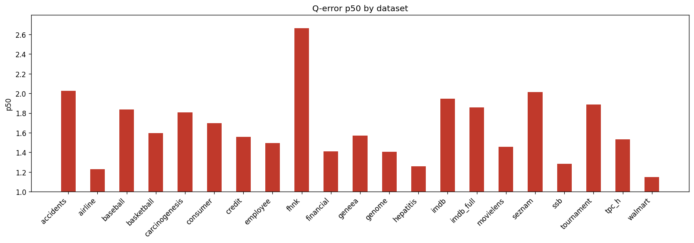

# Holdout Q-Error Results

**Datasets:** 21  |  **Total queries:** 291,424

## Results by dataset

| Dataset | Queries | avg | p50 | p90 | min | max |
|---------|--------:|----:|----:|----:|----:|----:|
| accidents | 10,495 | 6.2702 | 2.0251 | 15.9019 | 1.0001 | 404.1825 |
| airline | 12,323 | 2.0593 | 1.2288 | 3.7565 | 1.0001 | 80.0380 |
| baseball | 10,600 | 3.1271 | 1.8381 | 5.5582 | 1.0000 | 160.5955 |
| basketball | 9,002 | 2.3126 | 1.5975 | 4.0421 | 1.0000 | 724.9002 |
| carcinogenesis | 11,148 | 29.4807 | 1.8076 | 6.0323 | 1.0004 | 48025.0726 |
| consumer | 14,330 | 1.9438 | 1.6952 | 3.0661 | 1.0001 | 8.9155 |
| credit | 14,051 | 2.6696 | 1.5581 | 4.6811 | 1.0000 | 115.0162 |
| employee | 11,092 | 39.3025 | 1.4928 | 3.6394 | 1.0001 | 61327.8278 |
| fhnk | 11,070 | 3.5924 | 2.6649 | 6.7715 | 1.0003 | 82.1819 |
| financial | 12,139 | 2.5904 | 1.4105 | 4.6620 | 1.0000 | 107.3302 |
| geneea | 9,945 | 3.6176 | 1.5702 | 6.1874 | 1.0002 | 803.6073 |
| genome | 11,770 | 1.8540 | 1.4060 | 2.8447 | 1.0001 | 22.7711 |
| hepatitis | 10,999 | 17.7363 | 1.2574 | 2.9610 | 1.0001 | 24568.6573 |
| imdb | 27,843 | 3.6219 | 1.9474 | 5.5541 | 1.0001 | 375.9299 |
| imdb_full | 43,725 | 2.6184 | 1.8588 | 4.4875 | 1.0000 | 101.0793 |
| movielens | 11,788 | 2.0234 | 1.4576 | 3.4985 | 1.0000 | 19.3238 |
| seznam | 11,356 | 2.7359 | 2.0152 | 5.5096 | 1.0001 | 16.0668 |
| ssb | 13,396 | 1.5730 | 1.2841 | 2.2174 | 1.0000 | 27.2562 |
| tournament | 11,992 | 3.1865 | 1.8855 | 6.0645 | 1.0002 | 63.4788 |
| tpc_h | 9,868 | 2.0469 | 1.5323 | 3.3512 | 1.0002 | 32.7354 |
| walmart | 12,492 | 1.3802 | 1.1463 | 1.7825 | 1.0001 | 11.0916 |

## p50 by dataset

## Averages (over datasets)

| Metric | Value |
|--------|------:|
| **avg** | 6.4639 |
| **p50** | 1.6514 |
| **p90** | 4.8843 |
| **min** | 1.0001 |
| **max** | 6527.5266 |
