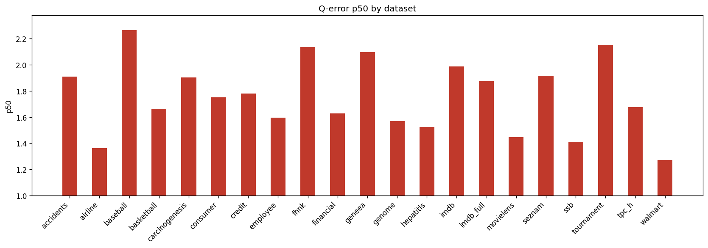

# Holdout Q-Error Results

**Datasets:** 21  |  **Total queries:** 291,424

## Results by dataset

| Dataset | Queries | avg | p50 | p90 | min | max |
|---------|--------:|----:|----:|----:|----:|----:|
| accidents | 10,495 | 6.9655 | 1.9111 | 23.2323 | 1.0001 | 110.2243 |
| airline | 12,323 | 2.6168 | 1.3630 | 5.6077 | 1.0000 | 39.7577 |
| baseball | 10,600 | 4.0028 | 2.2656 | 7.2630 | 1.0002 | 105.0758 |
| basketball | 9,002 | 2.3989 | 1.6653 | 4.5571 | 1.0001 | 337.4738 |
| carcinogenesis | 11,148 | 3.2033 | 1.9020 | 6.3556 | 1.0000 | 57.4176 |
| consumer | 14,330 | 1.9940 | 1.7509 | 3.1611 | 1.0000 | 10.6947 |
| credit | 14,051 | 3.2106 | 1.7789 | 4.9429 | 1.0000 | 111.8288 |
| employee | 11,092 | 2.4211 | 1.5948 | 4.0103 | 1.0001 | 73.4889 |
| fhnk | 11,070 | 2.6493 | 2.1360 | 4.8142 | 1.0000 | 12.4749 |
| financial | 12,139 | 2.6321 | 1.6267 | 4.9183 | 1.0000 | 56.1969 |
| geneea | 9,945 | 3.0428 | 2.0962 | 5.9215 | 1.0000 | 41.4023 |
| genome | 11,770 | 1.9135 | 1.5694 | 3.0142 | 1.0000 | 13.5519 |
| hepatitis | 10,999 | 1.9696 | 1.5257 | 3.0501 | 1.0002 | 26.4552 |
| imdb | 27,843 | 3.4609 | 1.9870 | 5.1995 | 1.0000 | 122.4698 |
| imdb_full | 43,725 | 2.6764 | 1.8749 | 4.5516 | 1.0000 | 63.2938 |
| movielens | 11,788 | 2.0885 | 1.4469 | 3.6029 | 1.0001 | 16.2460 |
| seznam | 11,356 | 2.5847 | 1.9177 | 4.8057 | 1.0002 | 20.2052 |
| ssb | 13,396 | 1.8820 | 1.4112 | 2.8563 | 1.0001 | 14.6760 |
| tournament | 11,992 | 3.6349 | 2.1488 | 7.5667 | 1.0001 | 52.8910 |
| tpc_h | 9,868 | 2.3024 | 1.6782 | 4.1628 | 1.0000 | 31.1749 |
| walmart | 12,492 | 1.6870 | 1.2708 | 2.5082 | 1.0000 | 17.9067 |

## p50 by dataset

## Averages (over datasets)

| Metric | Value |
|--------|------:|
| **avg** | 2.8256 |
| **p50** | 1.7581 |
| **p90** | 5.5287 |
| **min** | 1.0001 |
| **max** | 63.5670 |
