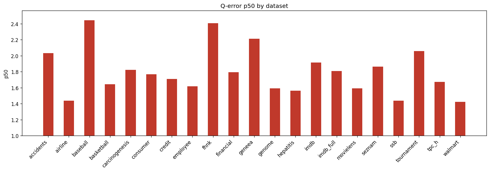

# Holdout Q-Error Results

**Datasets:** 21  |  **Total queries:** 291,424

## Results by dataset

| Dataset | Queries | avg | p50 | p90 | min | max |
|---------|--------:|----:|----:|----:|----:|----:|
| accidents | 10,495 | 6.5419 | 2.0312 | 20.9895 | 1.0002 | 95.4516 |
| airline | 12,323 | 3.1795 | 1.4366 | 7.5351 | 1.0000 | 63.8802 |
| baseball | 10,600 | 3.9825 | 2.4430 | 7.3887 | 1.0000 | 109.2232 |
| basketball | 9,002 | 2.3330 | 1.6415 | 4.5145 | 1.0000 | 388.7086 |
| carcinogenesis | 11,148 | 3.4096 | 1.8232 | 7.5357 | 1.0001 | 64.4107 |
| consumer | 14,330 | 2.0290 | 1.7683 | 3.2844 | 1.0001 | 11.0167 |
| credit | 14,051 | 2.8865 | 1.7102 | 4.7363 | 1.0001 | 79.3713 |
| employee | 11,092 | 2.2816 | 1.6187 | 3.7316 | 1.0000 | 46.7402 |
| fhnk | 11,070 | 2.7327 | 2.4081 | 4.7877 | 1.0002 | 12.5774 |
| financial | 12,139 | 2.4845 | 1.7936 | 4.0599 | 1.0000 | 44.0026 |
| geneea | 9,945 | 3.0126 | 2.2138 | 5.6987 | 1.0001 | 35.1842 |
| genome | 11,770 | 1.9640 | 1.5928 | 3.0741 | 1.0000 | 13.5833 |
| hepatitis | 10,999 | 1.9923 | 1.5627 | 2.9405 | 1.0000 | 20.4533 |
| imdb | 27,843 | 3.7577 | 1.9156 | 5.1899 | 1.0000 | 158.2827 |
| imdb_full | 43,725 | 2.6400 | 1.8077 | 4.5382 | 1.0000 | 54.8571 |
| movielens | 11,788 | 2.1388 | 1.5918 | 3.7224 | 1.0000 | 14.3687 |
| seznam | 11,356 | 2.5133 | 1.8636 | 4.6119 | 1.0001 | 20.6971 |
| ssb | 13,396 | 1.9378 | 1.4363 | 2.9272 | 1.0000 | 16.2332 |
| tournament | 11,992 | 3.4302 | 2.0590 | 7.0778 | 1.0000 | 50.6890 |
| tpc_h | 9,868 | 2.3249 | 1.6711 | 4.3634 | 1.0000 | 26.3024 |
| walmart | 12,492 | 1.7045 | 1.4244 | 2.2430 | 1.0001 | 15.1429 |

## p50 by dataset

## Averages (over datasets)

| Metric | Value |
|--------|------:|
| **avg** | 2.8227 |
| **p50** | 1.8006 |
| **p90** | 5.4738 |
| **min** | 1.0000 |
| **max** | 63.8655 |
