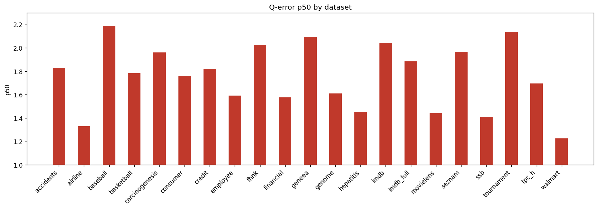

# Holdout Few-Shot Q-Error Results

**Datasets:** 21  |  **Total queries:** 291,424

## Results by dataset

| Dataset | Queries | avg | p50 | p90 | min | max |
|---------|--------:|----:|----:|----:|----:|----:|
| accidents | 10,495 | 7.3646 | 1.8283 | 25.2031 | 1.0002 | 129.9699 |
| airline | 12,323 | 2.2891 | 1.3297 | 4.6415 | 1.0001 | 46.0088 |
| baseball | 10,600 | 4.0199 | 2.1896 | 7.5089 | 1.0002 | 110.3586 |
| basketball | 9,002 | 2.5038 | 1.7840 | 4.5792 | 1.0000 | 311.2875 |
| carcinogenesis | 11,148 | 3.2105 | 1.9606 | 6.2765 | 1.0000 | 89.9038 |
| consumer | 14,330 | 1.9946 | 1.7572 | 3.1469 | 1.0000 | 9.6086 |
| credit | 14,051 | 3.7723 | 1.8194 | 5.5223 | 1.0001 | 157.5441 |
| employee | 11,092 | 2.4210 | 1.5925 | 4.0440 | 1.0001 | 72.3308 |
| fhnk | 11,070 | 2.7812 | 2.0255 | 5.4653 | 1.0001 | 15.1862 |
| financial | 12,139 | 2.7305 | 1.5780 | 5.4395 | 1.0002 | 57.1812 |
| geneea | 9,945 | 3.2159 | 2.0952 | 6.7040 | 1.0002 | 42.6495 |
| genome | 11,770 | 1.9265 | 1.6105 | 2.9689 | 1.0001 | 14.7857 |
| hepatitis | 10,999 | 1.9953 | 1.4505 | 3.0260 | 1.0000 | 29.2661 |
| imdb | 27,843 | 3.5387 | 2.0433 | 5.6526 | 1.0000 | 135.8879 |
| imdb_full | 43,725 | 2.8207 | 1.8841 | 4.8642 | 1.0001 | 85.4912 |
| movielens | 11,788 | 2.1472 | 1.4411 | 3.8337 | 1.0000 | 18.7590 |
| seznam | 11,356 | 2.6752 | 1.9677 | 5.0050 | 1.0002 | 21.2942 |
| ssb | 13,396 | 1.8511 | 1.4088 | 2.9191 | 1.0000 | 12.8624 |
| tournament | 11,992 | 3.6662 | 2.1382 | 7.8144 | 1.0001 | 54.2414 |
| tpc_h | 9,868 | 2.3365 | 1.6964 | 4.1701 | 1.0001 | 35.2857 |
| walmart | 12,492 | 1.6822 | 1.2264 | 2.6569 | 1.0000 | 18.6026 |

## p50 by dataset

## Averages (over datasets)

| Metric | Value |
|--------|------:|
| **avg** | 2.9020 |
| **p50** | 1.7537 |
| **p90** | 5.7830 |
| **min** | 1.0001 |
| **max** | 69.9288 |
