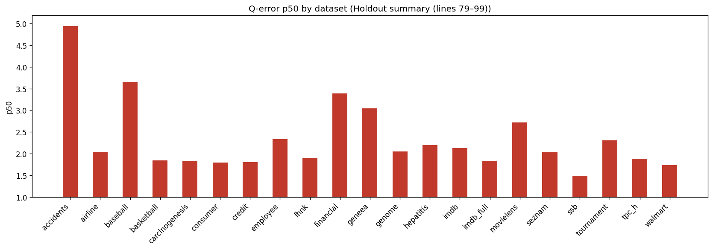
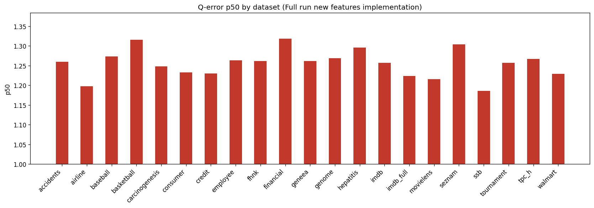
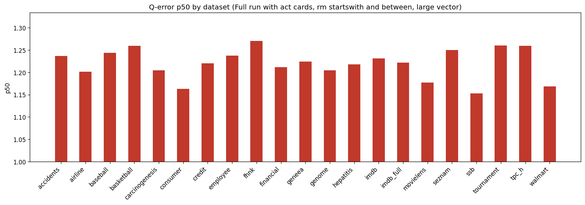
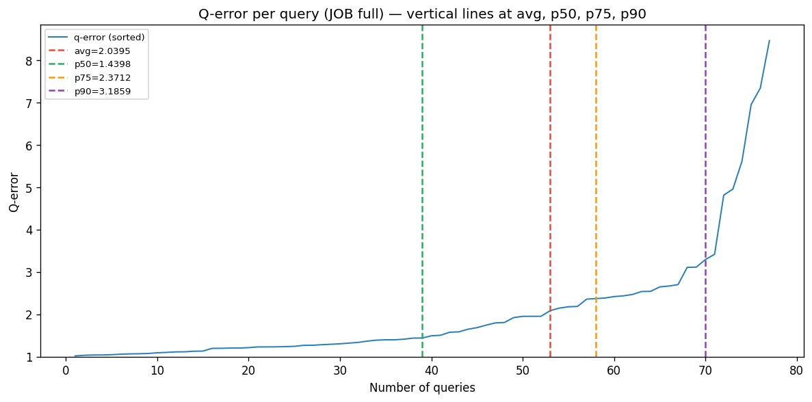

# Holdout (non-enriched) + JOB Q-Error Report

## 1. Holdout summary (lines 79–99)

**Datasets:** 21

### Median over datasets

| Metric | Value |
|--------|------:|
| **avg** | 3.0183 |
| **p50** | 2.0379 |
| **p90** | 5.7777 |
| **min** | 1.0001 |
| **max** | 31.3243 |

### p50 by dataset

## 2. Full run new features implementation

**Datasets:** 21

### Median over datasets

| Metric | Value |
|--------|------:|
| **avg** | 1.3640 |
| **p50** | 1.2598 |
| **p90** | 1.7799 |
| **min** | 1.0000 |
| **max** | 9.3606 |

### p50 by dataset

## 3. Full run with act cards, rm startswith and between, large vector

**Datasets:** 21

### Median over datasets

| Metric | Value |
|--------|------:|
| **avg** | 1.3424 |
| **p50** | 1.2215 |
| **p90** | 1.7758 |
| **min** | 1.0000 |
| **max** | 15.6188 |

### p50 by dataset

## 4. JOB full q-error (all queries)

**Queries:** 77

| Metric | Value |
|--------|------:|
| **avg** | 2.0395 |
| **p50** | 1.4398 |
| **p75** | 2.3712 |
| **p90** | 3.1859 |
| **min** | 1.0169 |
| **max** | 8.4621 |

### Q-error line (sorted) with avg, p50, p75, p90

