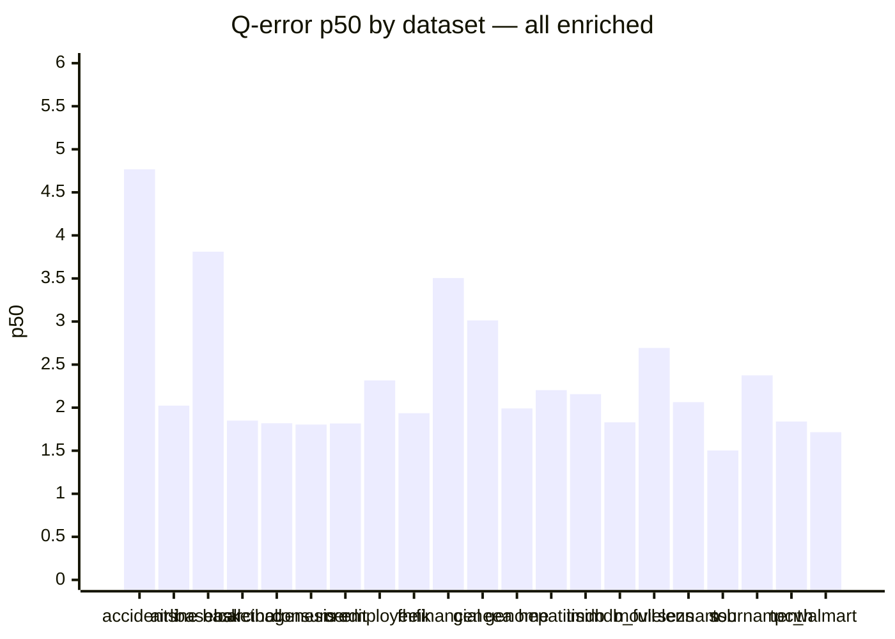
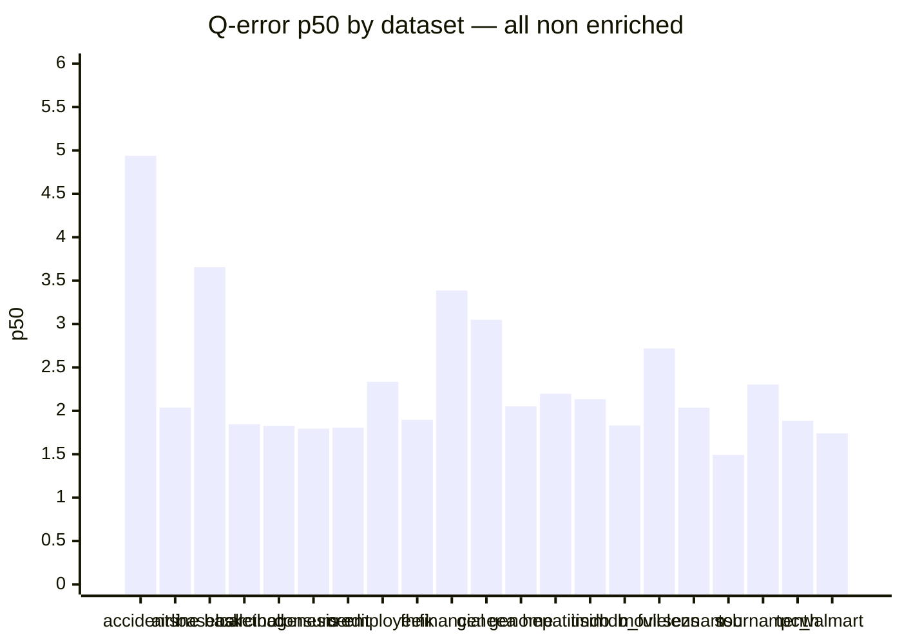

# Holdout Q-Error Results (grouped)

## all enriched

**Datasets:** 21  |  **Total queries:** 366,323

### Results by dataset

| Dataset | Queries | avg | p50 | p90 | min | max |
|---------|--------:|----:|----:|----:|----:|----:|
| accidents | 14,999 | 5.5364 | 4.7672 | 10.7251 | 1.0006 | 41.1304 |
| airline | 15,000 | 2.5934 | 2.0237 | 4.1200 | 1.0002 | 36.3917 |
| baseball | 15,000 | 4.8512 | 3.8112 | 9.7453 | 1.0000 | 27.1905 |
| basketball | 14,998 | 2.5209 | 1.8496 | 4.3451 | 1.0001 | 41.9736 |
| carcinogenesis | 14,934 | 2.4379 | 1.8186 | 4.5842 | 1.0000 | 55.7641 |
| consumer | 15,000 | 2.1685 | 1.8038 | 3.6923 | 1.0000 | 11.4309 |
| credit | 14,997 | 3.0887 | 1.8165 | 7.3994 | 1.0000 | 28.9959 |
| employee | 14,975 | 3.0212 | 2.3160 | 5.7882 | 1.0001 | 22.1832 |
| fhnk | 14,997 | 2.6652 | 1.9358 | 5.3115 | 1.0001 | 15.3347 |
| financial | 14,221 | 4.2479 | 3.5047 | 7.8955 | 1.0001 | 23.9347 |
| geneea | 15,000 | 4.7035 | 3.0129 | 10.5401 | 1.0001 | 32.8055 |
| genome | 14,995 | 2.5319 | 1.9905 | 4.6006 | 1.0002 | 18.1579 |
| hepatitis | 14,989 | 3.3819 | 2.2032 | 6.4004 | 1.0000 | 72.6371 |
| imdb | 31,426 | 4.3562 | 2.1573 | 7.5460 | 1.0001 | 218.3108 |
| imdb_full | 50,799 | 2.3948 | 1.8301 | 4.3752 | 1.0000 | 30.5975 |
| movielens | 14,999 | 3.5085 | 2.6929 | 7.1182 | 1.0002 | 48.4750 |
| seznam | 14,994 | 2.6381 | 2.0640 | 4.9148 | 1.0001 | 21.3494 |
| ssb | 15,000 | 1.8660 | 1.5029 | 3.2265 | 1.0000 | 14.8254 |
| tournament | 15,000 | 3.3471 | 2.3753 | 6.8359 | 1.0001 | 53.8486 |
| tpc_h | 15,000 | 2.9431 | 1.8390 | 6.7865 | 1.0000 | 30.6596 |
| walmart | 15,000 | 2.1155 | 1.7148 | 3.4963 | 1.0001 | 17.8621 |

### p50 by dataset

### Medians (over datasets)

| Metric | Value |
|--------|------:|
| **avg** | 2.9431 |
| **p50** | 2.0237 |
| **p90** | 5.7882 |
| **min** | 1.0001 |
| **max** | 30.5975 |

## all non enriched

**Datasets:** 21  |  **Total queries:** 366,323

### Results by dataset

| Dataset | Queries | avg | p50 | p90 | min | max |
|---------|--------:|----:|----:|----:|----:|----:|
| accidents | 14,999 | 6.2665 | 4.9387 | 13.5361 | 1.0000 | 42.7831 |
| airline | 15,000 | 2.7024 | 2.0379 | 4.3171 | 1.0001 | 42.6448 |
| baseball | 15,000 | 4.7104 | 3.6543 | 9.5408 | 1.0004 | 28.0499 |
| basketball | 14,998 | 2.5086 | 1.8460 | 4.2736 | 1.0001 | 45.0353 |
| carcinogenesis | 14,934 | 2.4503 | 1.8265 | 4.5078 | 1.0000 | 57.1253 |
| consumer | 15,000 | 2.1651 | 1.7950 | 3.7160 | 1.0001 | 11.2408 |
| credit | 14,997 | 3.0877 | 1.8064 | 7.4921 | 1.0001 | 30.0481 |
| employee | 14,975 | 3.0183 | 2.3350 | 5.7777 | 1.0002 | 21.0750 |
| fhnk | 14,997 | 2.6028 | 1.8982 | 5.0963 | 1.0000 | 15.7207 |
| financial | 14,221 | 4.1630 | 3.3862 | 7.7795 | 1.0000 | 33.9288 |
| geneea | 15,000 | 4.7976 | 3.0493 | 10.7533 | 1.0000 | 39.0929 |
| genome | 14,995 | 2.6282 | 2.0516 | 4.6962 | 1.0000 | 18.8050 |
| hepatitis | 14,989 | 3.2859 | 2.1963 | 5.9889 | 1.0001 | 68.9878 |
| imdb | 31,426 | 3.9495 | 2.1352 | 7.2328 | 1.0002 | 190.7902 |
| imdb_full | 50,799 | 2.3884 | 1.8320 | 4.3705 | 1.0000 | 31.3243 |
| movielens | 14,999 | 3.5147 | 2.7188 | 7.0971 | 1.0001 | 43.9015 |
| seznam | 14,994 | 2.5954 | 2.0364 | 4.7667 | 1.0001 | 22.1181 |
| ssb | 15,000 | 1.8590 | 1.4927 | 3.2438 | 1.0000 | 13.9662 |
| tournament | 15,000 | 3.2822 | 2.3033 | 6.6587 | 1.0000 | 77.8620 |
| tpc_h | 15,000 | 3.0304 | 1.8844 | 7.0460 | 1.0000 | 28.3949 |
| walmart | 15,000 | 2.1480 | 1.7399 | 3.5430 | 1.0001 | 18.6463 |

### p50 by dataset

### Medians (over datasets)

| Metric | Value |
|--------|------:|
| **avg** | 3.0183 |
| **p50** | 2.0379 |
| **p90** | 5.7777 |
| **min** | 1.0001 |
| **max** | 31.3243 |
