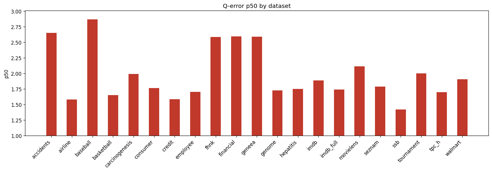

# Holdout Q-Error Results

**Datasets:** 21  |  **Total queries:** 291,424

## Results by dataset

| Dataset | Queries | avg | p50 | p90 | min | max |
|---------|--------:|----:|----:|----:|----:|----:|
| accidents | 10,495 | 5.4883 | 2.6521 | 14.8632 | 1.0000 | 69.7457 |
| airline | 12,323 | 3.3745 | 1.5793 | 7.6477 | 1.0002 | 80.7512 |
| baseball | 10,600 | 4.3332 | 2.8679 | 8.6365 | 1.0002 | 99.0722 |
| basketball | 9,002 | 2.3553 | 1.6523 | 4.4797 | 1.0002 | 487.2833 |
| carcinogenesis | 11,148 | 4.4570 | 1.9938 | 11.2861 | 1.0000 | 75.9811 |
| consumer | 14,330 | 2.0989 | 1.7647 | 3.4861 | 1.0000 | 11.3578 |
| credit | 14,051 | 2.6969 | 1.5862 | 4.7320 | 1.0001 | 64.2439 |
| employee | 11,092 | 2.2086 | 1.7019 | 3.7953 | 1.0000 | 32.9356 |
| fhnk | 11,070 | 3.5572 | 2.5883 | 7.2876 | 1.0000 | 18.4449 |
| financial | 12,139 | 2.9385 | 2.5980 | 4.9726 | 1.0001 | 21.0096 |
| geneea | 9,945 | 3.1012 | 2.5914 | 5.4706 | 1.0001 | 34.0384 |
| genome | 11,770 | 2.1406 | 1.7268 | 3.4369 | 1.0002 | 15.4976 |
| hepatitis | 10,999 | 2.2226 | 1.7521 | 3.4373 | 1.0002 | 12.8553 |
| imdb | 27,843 | 5.0490 | 1.8867 | 6.6320 | 1.0000 | 263.6580 |
| imdb_full | 43,725 | 2.5123 | 1.7437 | 4.3691 | 1.0000 | 33.4777 |
| movielens | 11,788 | 2.5954 | 2.1154 | 4.7160 | 1.0000 | 15.5112 |
| seznam | 11,356 | 2.4004 | 1.7883 | 4.2330 | 1.0001 | 21.5751 |
| ssb | 13,396 | 1.9556 | 1.4226 | 2.8667 | 1.0000 | 22.2965 |
| tournament | 11,992 | 3.1640 | 2.0021 | 6.2472 | 1.0000 | 45.9710 |
| tpc_h | 9,868 | 2.4960 | 1.7007 | 5.1287 | 1.0002 | 21.1285 |
| walmart | 12,492 | 1.9596 | 1.9047 | 2.6314 | 1.0003 | 10.9248 |

## p50 by dataset

## Averages (over datasets)

| Metric | Value |
|--------|------:|
| **avg** | 3.0050 |
| **p50** | 1.9819 |
| **p90** | 5.7312 |
| **min** | 1.0001 |
| **max** | 69.4171 |
