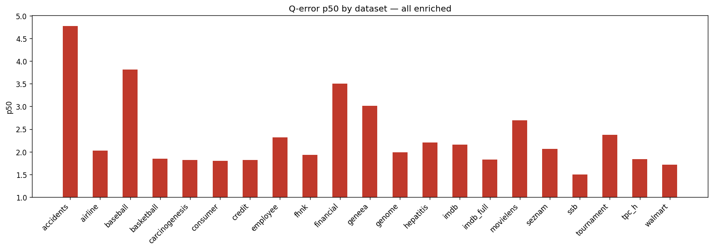
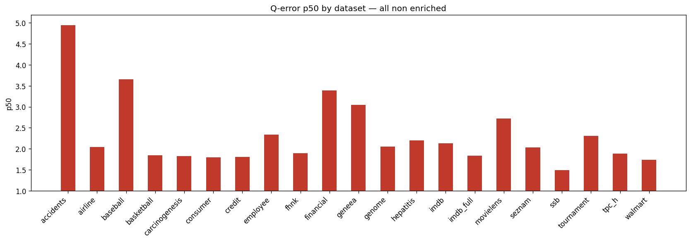
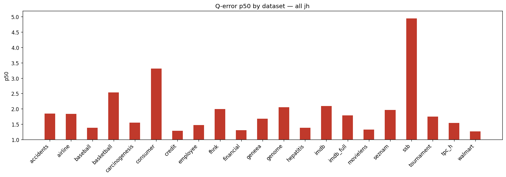
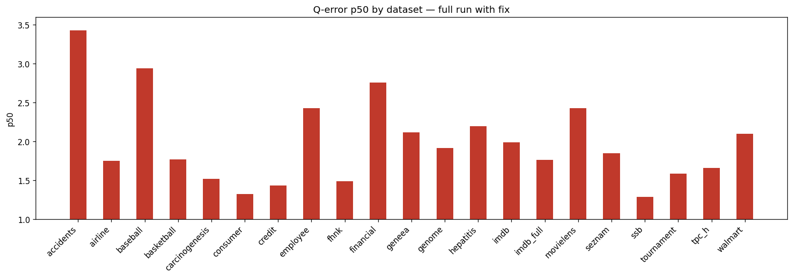
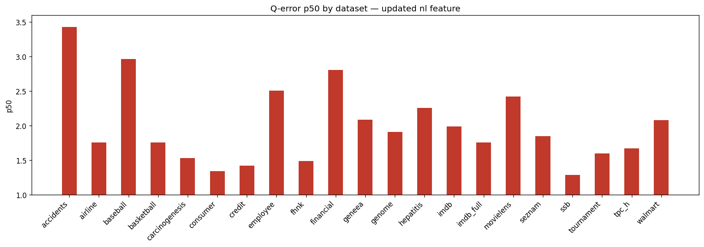
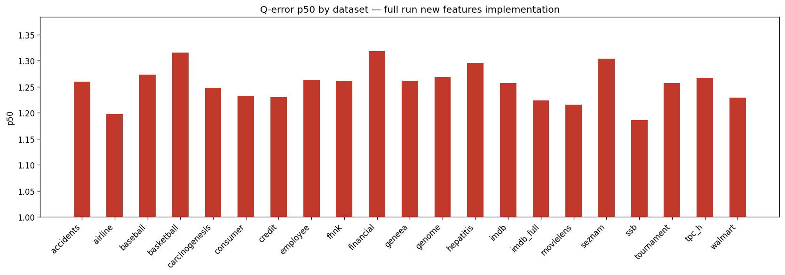

# Holdout Q-Error Results (grouped)

## all enriched

**Datasets:** 21  |  **Total queries:** 366,323

### Results by dataset

| Dataset | Queries | avg | p50 | p90 | min | max |
|---------|--------:|----:|----:|----:|----:|----:|
| accidents | 14,999 | 5.5364 | 4.7672 | 10.7251 | 1.0006 | 41.1304 |
| airline | 15,000 | 2.5934 | 2.0237 | 4.1200 | 1.0002 | 36.3917 |
| baseball | 15,000 | 4.8512 | 3.8112 | 9.7453 | 1.0000 | 27.1905 |
| basketball | 14,998 | 2.5209 | 1.8496 | 4.3451 | 1.0001 | 41.9736 |
| carcinogenesis | 14,934 | 2.4379 | 1.8186 | 4.5842 | 1.0000 | 55.7641 |
| consumer | 15,000 | 2.1685 | 1.8038 | 3.6923 | 1.0000 | 11.4309 |
| credit | 14,997 | 3.0887 | 1.8165 | 7.3994 | 1.0000 | 28.9959 |
| employee | 14,975 | 3.0212 | 2.3160 | 5.7882 | 1.0001 | 22.1832 |
| fhnk | 14,997 | 2.6652 | 1.9358 | 5.3115 | 1.0001 | 15.3347 |
| financial | 14,221 | 4.2479 | 3.5047 | 7.8955 | 1.0001 | 23.9347 |
| geneea | 15,000 | 4.7035 | 3.0129 | 10.5401 | 1.0001 | 32.8055 |
| genome | 14,995 | 2.5319 | 1.9905 | 4.6006 | 1.0002 | 18.1579 |
| hepatitis | 14,989 | 3.3819 | 2.2032 | 6.4004 | 1.0000 | 72.6371 |
| imdb | 31,426 | 4.3562 | 2.1573 | 7.5460 | 1.0001 | 218.3108 |
| imdb_full | 50,799 | 2.3948 | 1.8301 | 4.3752 | 1.0000 | 30.5975 |
| movielens | 14,999 | 3.5085 | 2.6929 | 7.1182 | 1.0002 | 48.4750 |
| seznam | 14,994 | 2.6381 | 2.0640 | 4.9148 | 1.0001 | 21.3494 |
| ssb | 15,000 | 1.8660 | 1.5029 | 3.2265 | 1.0000 | 14.8254 |
| tournament | 15,000 | 3.3471 | 2.3753 | 6.8359 | 1.0001 | 53.8486 |
| tpc_h | 15,000 | 2.9431 | 1.8390 | 6.7865 | 1.0000 | 30.6596 |
| walmart | 15,000 | 2.1155 | 1.7148 | 3.4963 | 1.0001 | 17.8621 |

### p50 by dataset

### Medians (over datasets)

| Metric | Value |
|--------|------:|
| **avg** | 2.9431 |
| **p50** | 2.0237 |
| **p90** | 5.7882 |
| **min** | 1.0001 |
| **max** | 30.5975 |

## all non enriched

**Datasets:** 21  |  **Total queries:** 366,323

### Results by dataset

| Dataset | Queries | avg | p50 | p90 | min | max |
|---------|--------:|----:|----:|----:|----:|----:|
| accidents | 14,999 | 6.2665 | 4.9387 | 13.5361 | 1.0000 | 42.7831 |
| airline | 15,000 | 2.7024 | 2.0379 | 4.3171 | 1.0001 | 42.6448 |
| baseball | 15,000 | 4.7104 | 3.6543 | 9.5408 | 1.0004 | 28.0499 |
| basketball | 14,998 | 2.5086 | 1.8460 | 4.2736 | 1.0001 | 45.0353 |
| carcinogenesis | 14,934 | 2.4503 | 1.8265 | 4.5078 | 1.0000 | 57.1253 |
| consumer | 15,000 | 2.1651 | 1.7950 | 3.7160 | 1.0001 | 11.2408 |
| credit | 14,997 | 3.0877 | 1.8064 | 7.4921 | 1.0001 | 30.0481 |
| employee | 14,975 | 3.0183 | 2.3350 | 5.7777 | 1.0002 | 21.0750 |
| fhnk | 14,997 | 2.6028 | 1.8982 | 5.0963 | 1.0000 | 15.7207 |
| financial | 14,221 | 4.1630 | 3.3862 | 7.7795 | 1.0000 | 33.9288 |
| geneea | 15,000 | 4.7976 | 3.0493 | 10.7533 | 1.0000 | 39.0929 |
| genome | 14,995 | 2.6282 | 2.0516 | 4.6962 | 1.0000 | 18.8050 |
| hepatitis | 14,989 | 3.2859 | 2.1963 | 5.9889 | 1.0001 | 68.9878 |
| imdb | 31,426 | 3.9495 | 2.1352 | 7.2328 | 1.0002 | 190.7902 |
| imdb_full | 50,799 | 2.3884 | 1.8320 | 4.3705 | 1.0000 | 31.3243 |
| movielens | 14,999 | 3.5147 | 2.7188 | 7.0971 | 1.0001 | 43.9015 |
| seznam | 14,994 | 2.5954 | 2.0364 | 4.7667 | 1.0001 | 22.1181 |
| ssb | 15,000 | 1.8590 | 1.4927 | 3.2438 | 1.0000 | 13.9662 |
| tournament | 15,000 | 3.2822 | 2.3033 | 6.6587 | 1.0000 | 77.8620 |
| tpc_h | 15,000 | 3.0304 | 1.8844 | 7.0460 | 1.0000 | 28.3949 |
| walmart | 15,000 | 2.1480 | 1.7399 | 3.5430 | 1.0001 | 18.6463 |

### p50 by dataset

### Medians (over datasets)

| Metric | Value |
|--------|------:|
| **avg** | 3.0183 |
| **p50** | 2.0379 |
| **p90** | 5.7777 |
| **min** | 1.0001 |
| **max** | 31.3243 |

## all jh

**Datasets:** 21  |  **Total queries:** 366,323

### Results by dataset

| Dataset | Queries | avg | p50 | p90 | min | max |
|---------|--------:|----:|----:|----:|----:|----:|
| accidents | 14,999 | 277185.0250 | 1.8500 | 4.4550 | 1.0001 | 1044900000.0000 |
| airline | 15,000 | 10649068.8860 | 1.8325 | 5.4502 | 1.0000 | 26496240000.0000 |
| baseball | 15,000 | 175793.1546 | 1.3821 | 2.6674 | 1.0000 | 1174480000.0000 |
| basketball | 14,998 | 17836645.2017 | 2.5341 | 9.4698 | 1.0001 | 8978030000.0000 |
| carcinogenesis | 14,934 | 176337.9481 | 1.5491 | 17.0559 | 1.0000 | 2633130000.0000 |
| consumer | 15,000 | 14855113.4015 | 3.3132 | 5.8685 | 1.0004 | 12152310000.0000 |
| credit | 14,997 | 17662653.9991 | 1.2886 | 2.2364 | 1.0001 | 10350780000.0000 |
| employee | 14,975 | 24660293.5595 | 1.4694 | 2.8524 | 1.0001 | 6379320000.0000 |
| fhnk | 14,997 | 9269455.6363 | 1.9981 | 5.7457 | 1.0001 | 2887270000.0000 |
| financial | 14,221 | 3957176.9897 | 1.3034 | 3.2370 | 1.0000 | 3189940000.0000 |
| geneea | 15,000 | 26947763.1937 | 1.6790 | 3.0999 | 1.0000 | 10468560000.0000 |
| genome | 14,995 | 24986045.5393 | 2.0489 | 4.5647 | 1.0000 | 8626130000.0000 |
| hepatitis | 14,989 | 29.6821 | 1.3839 | 7.2673 | 1.0000 | 4263.2524 |
| imdb | 31,426 | 10474394.2110 | 2.0917 | 7.5137 | 1.0000 | 23226440000.0000 |
| imdb_full | 50,799 | 7931159.4110 | 1.7841 | 4.7643 | 1.0000 | 10384300000.0000 |
| movielens | 14,999 | 519946.5880 | 1.3234 | 2.8059 | 1.0000 | 1804470000.0000 |
| seznam | 14,994 | 5989358.2361 | 1.9628 | 4.4014 | 1.0002 | 3437440000.0000 |
| ssb | 15,000 | 130816927.2134 | 4.9398 | 9.6699 | 1.0009 | 16043030000.0000 |
| tournament | 15,000 | 21364210.9983 | 1.7523 | 8.9688 | 1.0001 | 4945640000.0000 |
| tpc_h | 15,000 | 22832986.5589 | 1.5446 | 3.5924 | 1.0001 | 38144990000.0000 |
| walmart | 15,000 | 21581976.9326 | 1.2632 | 3.2460 | 1.0000 | 3820970000.0000 |

### p50 by dataset

### Medians (over datasets)

| Metric | Value |
|--------|------:|
| **avg** | 10649068.8860 |
| **p50** | 1.7523 |
| **p90** | 4.5647 |
| **min** | 1.0000 |
| **max** | 6379320000.0000 |

## all jh (fixed)

**Datasets:** 21  |  **Total queries:** 366,323

### Results by dataset

| Dataset | Queries | avg | p50 | p90 | min | max |
|---------|--------:|----:|----:|----:|----:|----:|
| accidents | 14,999 | 2.7246 | 1.8099 | 5.4975 | 1.0000 | 170.5349 |
| airline | 15,000 | 7.1508 | 2.0642 | 4.4437 | 1.0000 | 24008.1889 |
| baseball | 15,000 | 1.8177 | 1.4122 | 2.7834 | 1.0000 | 172.1161 |
| basketball | 14,998 | 4.8350 | 1.7851 | 6.3912 | 1.0001 | 660.8822 |
| carcinogenesis | 14,934 | 45.6476 | 1.6199 | 13.5384 | 1.0001 | 21065.6814 |
| consumer | 15,000 | 1.5910 | 1.2961 | 2.1260 | 1.0000 | 232.9939 |
| credit | 14,997 | 1.7555 | 1.3137 | 2.2059 | 1.0000 | 577.9208 |
| employee | 14,975 | 7.0269 | 1.5940 | 2.8460 | 1.0000 | 16627.5550 |
| fhnk | 14,997 | 4.6445 | 1.9188 | 6.3986 | 1.0000 | 19481.5977 |
| financial | 14,221 | 10.7045 | 1.3221 | 3.6238 | 1.0000 | 42379.6980 |
| geneea | 15,000 | 2.1527 | 1.6162 | 3.2311 | 1.0001 | 116.4919 |
| genome | 14,995 | 3.6154 | 1.5549 | 3.0987 | 1.0001 | 10201.6151 |
| hepatitis | 14,989 | 16.3816 | 1.6663 | 6.6215 | 1.0000 | 7289.4420 |
| imdb | 31,426 | 63.2519 | 2.1101 | 7.1841 | 1.0000 | 355032.8341 |
| imdb_full | 50,799 | 113.0584 | 1.7006 | 3.9209 | 1.0000 | 622906.3639 |
| movielens | 14,999 | 2.3504 | 1.5003 | 2.9495 | 1.0000 | 2035.6757 |
| seznam | 14,994 | 2.0992 | 1.6468 | 3.5638 | 1.0002 | 63.3684 |
| ssb | 15,000 | 2.2036 | 1.7723 | 3.1068 | 1.0000 | 2089.1491 |
| tournament | 15,000 | 3.2415 | 1.5129 | 6.3292 | 1.0000 | 326.2434 |
| tpc_h | 15,000 | 2.5029 | 1.4748 | 3.3092 | 1.0000 | 603.2708 |
| walmart | 15,000 | 3.2389 | 1.2708 | 3.5003 | 1.0000 | 1866.7405 |

### p50 by dataset

_p50_bars.png)

### Medians (over datasets)

| Metric | Value |
|--------|------:|
| **avg** | 3.2415 |
| **p50** | 1.6162 |
| **p90** | 3.5638 |
| **min** | 1.0000 |
| **max** | 2035.6757 |

## full run with fix

**Datasets:** 21  |  **Total queries:** 366,323

### Results by dataset

| Dataset | Queries | avg | p50 | p90 | min | max |
|---------|--------:|----:|----:|----:|----:|----:|
| accidents | 14,999 | 3.9373 | 3.4277 | 7.2079 | 1.0000 | 28.4418 |
| airline | 15,000 | 2.4252 | 1.7528 | 4.6459 | 1.0001 | 20.4491 |
| baseball | 15,000 | 3.8467 | 2.9395 | 7.6007 | 1.0000 | 49.8400 |
| basketball | 14,998 | 2.5107 | 1.7721 | 4.7378 | 1.0000 | 24.0255 |
| carcinogenesis | 14,934 | 2.0670 | 1.5179 | 3.6116 | 1.0000 | 38.3017 |
| consumer | 15,000 | 1.6111 | 1.3263 | 2.4976 | 1.0000 | 7.6735 |
| credit | 14,997 | 2.0551 | 1.4368 | 3.7907 | 1.0001 | 43.9560 |
| employee | 14,975 | 3.0077 | 2.4254 | 5.6348 | 1.0001 | 20.1360 |
| fhnk | 14,997 | 2.0111 | 1.4879 | 3.9397 | 1.0000 | 12.0392 |
| financial | 14,221 | 3.2276 | 2.7577 | 5.8538 | 1.0001 | 32.4113 |
| geneea | 15,000 | 3.6226 | 2.1195 | 8.2382 | 1.0000 | 29.9247 |
| genome | 14,995 | 2.3586 | 1.9159 | 4.0256 | 1.0002 | 16.1503 |
| hepatitis | 14,989 | 3.1335 | 2.1981 | 4.8739 | 1.0000 | 36.6594 |
| imdb | 31,426 | 3.4474 | 1.9884 | 6.5418 | 1.0000 | 60.6181 |
| imdb_full | 50,799 | 2.1243 | 1.7635 | 3.5648 | 1.0000 | 20.8576 |
| movielens | 14,999 | 2.9109 | 2.4275 | 5.5089 | 1.0001 | 15.9705 |
| seznam | 14,994 | 2.2964 | 1.8481 | 4.0850 | 1.0002 | 13.6286 |
| ssb | 15,000 | 1.4992 | 1.2887 | 2.1939 | 1.0000 | 10.3557 |
| tournament | 15,000 | 2.3356 | 1.5872 | 4.5251 | 1.0000 | 49.6177 |
| tpc_h | 15,000 | 2.6454 | 1.6619 | 5.8451 | 1.0001 | 26.9295 |
| walmart | 15,000 | 2.3672 | 2.0987 | 3.7775 | 1.0001 | 14.8415 |

### p50 by dataset

### Medians (over datasets)

| Metric | Value |
|--------|------:|
| **avg** | 2.4252 |
| **p50** | 1.8481 |
| **p90** | 4.6459 |
| **min** | 1.0000 |
| **max** | 24.0255 |

## updated nl feature

**Datasets:** 21  |  **Total queries:** 366,323

### Results by dataset

| Dataset | Queries | avg | p50 | p90 | min | max |
|---------|--------:|----:|----:|----:|----:|----:|
| accidents | 14,999 | 3.9532 | 3.4253 | 7.2882 | 1.0002 | 28.3231 |
| airline | 15,000 | 2.4368 | 1.7565 | 4.6229 | 1.0000 | 27.5287 |
| baseball | 15,000 | 3.8879 | 2.9608 | 7.6928 | 1.0000 | 59.6112 |
| basketball | 14,998 | 2.5083 | 1.7542 | 4.7667 | 1.0000 | 25.0717 |
| carcinogenesis | 14,934 | 2.0806 | 1.5327 | 3.6750 | 1.0000 | 33.3834 |
| consumer | 15,000 | 1.6197 | 1.3404 | 2.5239 | 1.0001 | 7.2879 |
| credit | 14,997 | 2.0108 | 1.4241 | 3.7010 | 1.0000 | 31.3441 |
| employee | 14,975 | 3.0535 | 2.5066 | 5.6851 | 1.0000 | 21.4622 |
| fhnk | 14,997 | 2.0022 | 1.4862 | 3.8926 | 1.0001 | 12.4760 |
| financial | 14,221 | 3.2453 | 2.8071 | 5.8493 | 1.0003 | 36.9141 |
| geneea | 15,000 | 3.6240 | 2.0827 | 8.2621 | 1.0000 | 31.1165 |
| genome | 14,995 | 2.3547 | 1.9103 | 4.0735 | 1.0001 | 18.0902 |
| hepatitis | 14,989 | 3.1632 | 2.2580 | 4.8875 | 1.0001 | 37.7047 |
| imdb | 31,426 | 3.4140 | 1.9865 | 6.3682 | 1.0000 | 66.9353 |
| imdb_full | 50,799 | 2.1179 | 1.7558 | 3.5472 | 1.0000 | 23.6657 |
| movielens | 14,999 | 2.9147 | 2.4228 | 5.5505 | 1.0001 | 14.4958 |
| seznam | 14,994 | 2.2999 | 1.8486 | 4.1388 | 1.0003 | 13.0633 |
| ssb | 15,000 | 1.4950 | 1.2843 | 2.1812 | 1.0000 | 10.5248 |
| tournament | 15,000 | 2.3235 | 1.6001 | 4.4725 | 1.0001 | 49.9024 |
| tpc_h | 15,000 | 2.6612 | 1.6708 | 5.8693 | 1.0000 | 29.1589 |
| walmart | 15,000 | 2.4157 | 2.0784 | 3.9852 | 1.0000 | 13.8513 |

### p50 by dataset

### Medians (over datasets)

| Metric | Value |
|--------|------:|
| **avg** | 2.4368 |
| **p50** | 1.8486 |
| **p90** | 4.6229 |
| **min** | 1.0000 |
| **max** | 27.5287 |

## full run new features implementation

**Datasets:** 21  |  **Total queries:** 366,323

### Results by dataset

| Dataset | Queries | avg | p50 | p90 | min | max |
|---------|--------:|----:|----:|----:|----:|----:|
| accidents | 14,999 | 1.3415 | 1.2598 | 1.7107 | 1.0001 | 12.1739 |
| airline | 15,000 | 1.3471 | 1.1974 | 1.8434 | 1.0000 | 5.1119 |
| baseball | 15,000 | 1.3921 | 1.2730 | 1.8773 | 1.0000 | 8.6423 |
| basketball | 14,998 | 1.4253 | 1.3156 | 1.8922 | 1.0001 | 7.1810 |
| carcinogenesis | 14,934 | 1.3873 | 1.2475 | 1.7799 | 1.0000 | 96.9005 |
| consumer | 15,000 | 1.2691 | 1.2322 | 1.5571 | 1.0000 | 3.0451 |
| credit | 14,997 | 1.3393 | 1.2302 | 1.7109 | 1.0001 | 55.1940 |
| employee | 14,975 | 1.3488 | 1.2631 | 1.7635 | 1.0001 | 4.4834 |
| fhnk | 14,997 | 1.3922 | 1.2614 | 1.8854 | 1.0000 | 53.6125 |
| financial | 14,221 | 1.5387 | 1.3179 | 2.3183 | 1.0001 | 12.8791 |
| geneea | 15,000 | 1.3910 | 1.2617 | 1.8194 | 1.0001 | 6.8413 |
| genome | 14,995 | 1.3569 | 1.2684 | 1.7674 | 1.0000 | 4.9624 |
| hepatitis | 14,989 | 1.5028 | 1.2955 | 2.2334 | 1.0000 | 6.4666 |
| imdb | 31,426 | 1.4781 | 1.2570 | 1.9405 | 1.0000 | 38.6416 |
| imdb_full | 50,799 | 1.3235 | 1.2236 | 1.6892 | 1.0000 | 23.5345 |
| movielens | 14,999 | 1.2910 | 1.2150 | 1.6200 | 1.0000 | 5.9272 |
| seznam | 14,994 | 1.4157 | 1.3040 | 1.9164 | 1.0000 | 7.5381 |
| ssb | 15,000 | 1.2456 | 1.1855 | 1.5067 | 1.0000 | 20.0050 |
| tournament | 15,000 | 1.3640 | 1.2564 | 1.7383 | 1.0001 | 70.5727 |
| tpc_h | 15,000 | 1.6006 | 1.2671 | 2.0031 | 1.0000 | 783.1222 |
| walmart | 15,000 | 1.3101 | 1.2287 | 1.6132 | 1.0000 | 9.3606 |

### p50 by dataset

### Medians (over datasets)

| Metric | Value |
|--------|------:|
| **avg** | 1.3640 |
| **p50** | 1.2598 |
| **p90** | 1.7799 |
| **min** | 1.0000 |
| **max** | 9.3606 |
